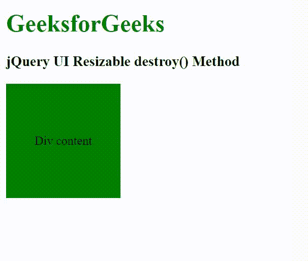

# jQuery UI 可调整大小组件 destroy() 方法

> 原文: [https://www.geeksforgeeks.org/jquery-ui-resizable-destroy-method/](https://www.geeksforgeeks.org/jquery-ui-resizable-destroy-method/)

jQuery UI 由图形用户界面小部件、视觉效果和使用 jQuery、CSS 和 HTML 实现的主题组成。jQuery UI 非常适合为网页构建用户界面。jQuery UI Resizable `destroy()` 方法用于完全移除可调整大小的功能。此方法不接受任何参数。

## 语法

```html
$( ".selector" ).resizable( "destroy" );
```

## CDN 链接

首先，添加项目所需的 jQuery UI 脚本。

> <link rel="stylesheet" href="//code.jquery.com/ui/1.12.1/themes/smoothness/jquery-ui.css">
> <script src="//code.jquery.com/jquery-1.12.4.js"></script>
> <script src="//code.jquery.com/ui/1.12.1/jquery-ui.js"></script>

## 示例

### HTML

```html
<!doctype html>
<html lang="en">

<head>
    <meta charset="utf-8">
    <link rel="stylesheet" href="//code.jquery.com/ui/1.12.1/themes/smoothness/jquery-ui.css">
    <script src="//code.jquery.com/jquery-1.12.4.js"></script>
    <script src="//code.jquery.com/ui/1.12.1/jquery-ui.js"></script>

    <style>
        h1 {
            color: green;
        }

        #first_div {
            width: 150px;
            height: 150px;
            background: green;
            display: flex;
            justify-content: center;
            align-items: center;
            text-align: center;
        }
    </style>
</head>

<body>
    <h1>GeeksforGeeks</h1>

    <h3>jQuery UI Resizable destroy() Method</h3>

    <div id="first_div">Div content</div>

    <script>
        $(function () {
            $("#first_div").resizable("destroy");
        });
    </script>
</body>

</html>
```

## 输出



## 参考

[https://api.jqueryui.com/resizable/#method-destroy](https://api.jqueryui.com/resizable/#method-destroy)