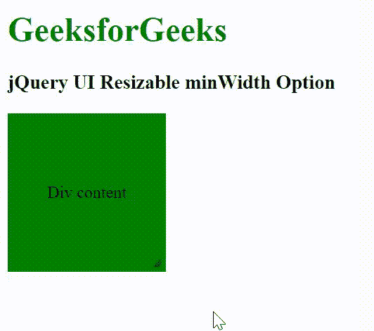

# jQuery UI Resizable minWidth Option

> 原文: [https://www.geeksforgeeks.org/jquery-ui-resizable-minwidth-option/](https://www.geeksforgeeks.org/jquery-ui-resizable-minwidth-option/)

jQuery UI 由图形用户界面小部件、视觉效果和使用 jQuery、CSS 和 HTML 实现的主题组成。jQuery UI 非常适合为网页构建用户界面。jQuery UI 的 `resizable` 方法的 `minWidth` 选项用于设置可调整大小元素的最小宽度。

## Syntax

```javascript
$(".selector").resizable({
   minWidth: width_val
});
```

## CDN Link

首先，添加项目所需的 jQuery UI 脚本。

```html
<link rel="stylesheet" href="//code.jquery.com/ui/1.12.1/themes/smoothness/jquery-ui.css">
<script src="//code.jquery.com/jquery-1.12.4.js"></script>
<script src="//code.jquery.com/ui/1.12.1/jquery-ui.js"></script>
```

## Example

### HTML

```html
<!doctype html>
<html lang="en">

<head>
    <meta charset="utf-8">
    <link rel="stylesheet" href="//code.jquery.com/ui/1.12.1/themes/smoothness/jquery-ui.css">
    <script src="//code.jquery.com/jquery-1.12.4.js"></script>
    <script src="//code.jquery.com/ui/1.12.1/jquery-ui.js"></script>
    <style>
        h1 {
            color: green;
        }
        #first_div {
            width: 150px;
            height: 150px;
            background: green;
            display: flex;
            justify-content: center;
            align-items: center;
            text-align: center;
        }
    </style>
</head>

<body>
    <h1>GeeksforGeeks</h1>
    <h3>jQuery UI Resizable minWidth Option</h3>
    <div id="first_div">Div content</div>
    <script>
        $(function () {
            $("#first_div").resizable({
                minWidth: 100
            });
        });
    </script>
</body>

</html>
```

## Output



## Reference

[https://api.jqueryui.com/resizable/#option-minWidth](https://api.jqueryui.com/resizable/#option-minWidth)