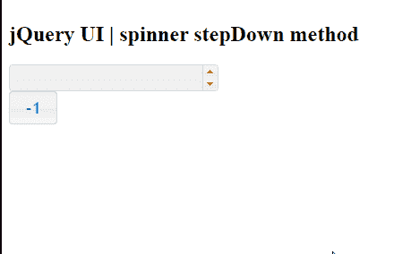

# jQuery UI 微调器 stepDown() 方法

> 原文: [https://www.geeksforgeeks.org/jquery-ui-spinner-stepdown-method/](https://www.geeksforgeeks.org/jquery-ui-spinner-stepdown-method/)

jQuery UI 由 GUI 小部件、视觉效果和使用 HTML、CSS 和 jQuery 实现的主题组成。jQuery 用户界面非常适合为网页构建用户界面。jQuery UI 微调器小部件帮助我们使用上下箭头来增加和减少输入元素的值。在本文中，我们将看到如何在 jQuery UI 滑块中使用 `stepDown()` 方法。
在 jQuery UI 微调器中，给定没有步长的情况下，`stepDown()` 方法用于减少步长值。

## 语法

```html
$(".selector").spinner("stepDown");
```

## 方法

首先，添加项目所需的 jQuery UI 脚本。

```html
<link href="https://code.jquery.com/ui/1.10.4/themes/ui-lightness/jquery-ui.css" rel="stylesheet">
<script src="https://code.jquery.com/jquery-1.10.2.js"></script>
<script src="https://code.jquery.com/ui/1.10.4/jquery-ui.js"></script>
```

## 示例

### HTML

```html
<!doctype html>
<html lang="en">

<head>
    <meta charset="utf-8">
    <link href=
"https://code.jquery.com/ui/1.10.4/themes/ui-lightness/jquery-ui.css"
        rel="stylesheet">
    <script src="https://code.jquery.com/jquery-1.10.2.js"></script>

<script src="https://code.jquery.com/ui/1.10.4/jquery-ui.js">
    </script>

<style type="text/css">
        #gfg input {
            width: 100px
        }
    </style>

<script>
        $(function() {
            $("#gfg").spinner();
            $('button').button();

$('#gfg1').click(function() {
                $("#gfg").spinner("stepDown");
            });
        });
    </script>
</head>

<body>
    <h1>GeeksforGeeks</h1>
    <h2>jQuery UI | spinner stepDown method</h2>
    <input id="gfg" />
    <br/>
    <button id="gfg1">-1</button>
</body>

</html>
```

## 输出

