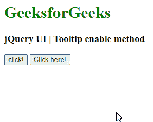

# jQuery UI Tooltip enable() 方法

> 原文：[https://www.geeksforgeeks.org/jquery-ui-tooltips-enable-method/](https://www.geeksforgeeks.org/jquery-ui-tooltips-enable-method/)

jQuery UI 由 GUI 小部件、视觉效果和使用 jQuery、CSS 和 HTML 实现的主题组成。jQuery UI 非常适合为网页构建用户界面。jQuery UI Tooltip 小部件帮助我们添加新主题并允许自定义。在本文中，我们将看到如何在 jQuery UI Tooltip 中使用 `enable` 选项。`enable` 选项用于启用 jQuery UI 中的工具提示。

## 语法

```html
$(".selector").tooltip("enable");
```

## 参数

此方法不接受任何参数。

## CDN 链接

首先，添加项目所需的 jQuery UI 脚本。

```html
<link href="https://code.jquery.com/ui/1.10.4/themes/ui-lightness/jquery-ui.css" rel="stylesheet">
<script src="https://code.jquery.com/jquery-1.10.2.js"></script>
<script src="https://code.jquery.com/ui/1.10.4/jquery-ui.js"></script>
```

## 示例

以下示例演示了工具提示的 `enable` 选项。`track` 选项设置为 `true`，该选项已启用。为了更好地理解，请参考输出。

### HTML

```html
<!DOCTYPE html>
<html lang="en">
  <head>
    <meta charset="utf-8" />
    <link
      href="https://code.jquery.com/ui/1.10.4/themes/ui-lightness/jquery-ui.css"
      rel="stylesheet"
    />
    <script src="https://code.jquery.com/jquery-1.10.2.js">
    </script>
    <script src="https://code.jquery.com/ui/1.10.4/jquery-ui.js">
    </script>

    <h1 style="color: green">GeeksforGeeks</h1>
    <h3>jQuery UI | Tooltip enable method</h3>

    <script>
      $(function () {
        $("#gfgtt").tooltip({
          track: true,
        });
        $("#gfg").click(function () {
          $("#gfgtt").tooltip("enable");
        });
      });
    </script>
  </head>

  <body>
    <input id="gfg" type="submit" name="GeeksforGeeks" value="click!" />
    <button id="gfgtt" title="GeeksforGeeks">Click here!</button>
  </body>
</html>
```

## 输出



## 参考

[https://api.jqueryui.com/tooltip/#method-enable](https://api.jqueryui.com/tooltip/#method-enable)