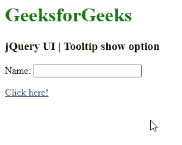
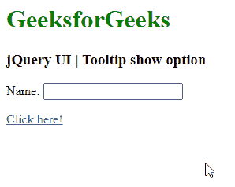
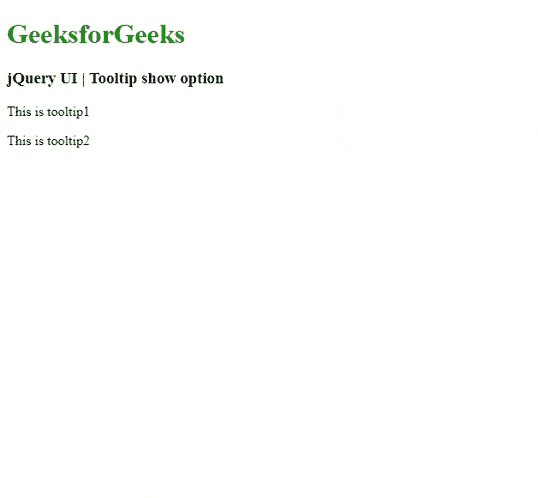

# jQuery UI Tooltip `show` 选项

> 原文: [https://www.geeksforgeeks.org/jquery-ui-tooltips-show-option/](https://www.geeksforgeeks.org/jquery-ui-tooltips-show-option/)

jQuery UI 由 GUI 小部件、视觉效果和使用 jQuery、CSS 和 HTML 实现的主题组成。jQuery UI 非常适合为网页构建用户界面。jQuery UI Tooltip 小部件帮助我们添加新的主题，并允许自定义。在本文中，我们将看到如何在 jQuery UI Tooltip 中使用 `show` 选项。`show` 选项用于在 jQuery UI Tooltip 显示时添加动画效果。默认情况下，该值为 `true`。

**语法:**

```html
$(".selector").tooltip(
   { show: true }
);
```

**参数:**

*   **布尔值:** 如果设置为 `false` 则没有显示效果。
*   **数字:** 显示工具提示的时间（毫秒）。
*   **字符串:** 该字符串用于显示工具提示的选定效果。该效果将用于显示使用默认的持续时间和缓动。
*   **对象:** 工具提示使用对象作为值显示，其中提供了 `effect`、`easing`、`duration` 和 `delay` 属性。

**步骤:**

*   首先，添加项目所需的 jQuery UI 脚本。

```html
<link href="https://code.jquery.com/ui/1.10.4/themes/ui-lightness/jquery-ui.css" rel="stylesheet">
```

**示例 1:** 以下代码演示了以毫秒为单位的 `show` 选项的设置。

## HTML

```html
<!doctype html>
<html lang="en">
<head>
  <meta charset="utf-8">
  <title>jquery-ui-tooltip-show-option</title>
  <link href="https://code.jquery.com/ui/1.10.4/themes/ui-lightness/jquery-ui.css" rel="stylesheet">
  <script src="https://code.jquery.com/jquery-1.10.2.js"></script>
  <script src="https://code.jquery.com/ui/1.10.4/jquery-ui.js"></script>
  <script>
  $(function() {
    $( document ).tooltip({
      show: {
        effect: "blind",
        duration: 1000
      }
    });
  });
  </script>
</head>
<body>
<p><a href="#" title="That&apos;s what this widget is">Tooltips</a> can be attached to any element.</p>
</body>
</html>
```

**输出:**



**示例 2:** 以下代码演示了使用布尔值设置 `show` 选项。

## HTML

```html
<!doctype html>
<html lang="en">
<head>
  <meta charset="utf-8">
  <title>jquery-ui-tooltip-show-option</title>
  <link href="https://code.jquery.com/ui/1.10.4/themes/ui-lightness/jquery-ui.css" rel="stylesheet">
  <script src="https://code.jquery.com/jquery-1.10.2.js"></script>
  <script src="https://code.jquery.com/ui/1.10.4/jquery-ui.js"></script>
  <script>
  $(function() {
    $( document ).tooltip({
      show: false
    });
  });
  </script>
</head>
<body>
<p><a href="#" title="That&apos;s what this widget is">Tooltips</a> can be attached to any element.</p>
</body>
</html>
```

**输出:**



**示例 3:** 以下示例演示了工具提示使用 `slide` 和 `fold` 功能的 `show` 选项。为了更好地理解，请参考输出图像。

## HTML

```html
<!doctype html>
<html lang="en">
<head>
  <meta charset="utf-8">
  <title>jquery-ui-tooltip-show-option</title>
  <link href="https://code.jquery.com/ui/1.10.4/themes/ui-lightness/jquery-ui.css" rel="stylesheet">
  <script src="https://code.jquery.com/jquery-1.10.2.js"></script>
  <script src="https://code.jquery.com/ui/1.10.4/jquery-ui.js"></script>
  <script>
  $(function() {
    $( document ).tooltip({
      show: {
        effect: "fold",
        duration: 1000
      }
    });
  });
  </script>
</head>
<body>
<p><a href="#" title="That&apos;s what this widget is">Tooltips</a> can be attached to any element.</p>
</body>
</html>
```

**输出:**



**参考:** [https://api.jqueryui.com/category/widgets/](https://api.jqueryui.com/category/widgets/)