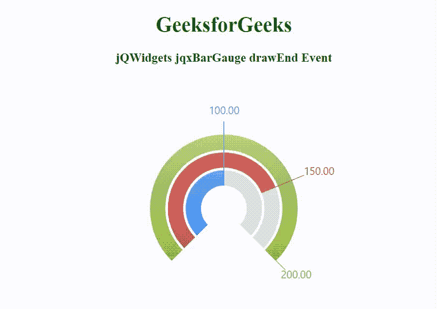

# jQWidgets jqxBarGauge drawEnd 事件

> 原文: [https://www.geeksforgeeks.org/jqwidgets-jqxbargauge-drawend-event/](https://www.geeksforgeeks.org/jqwidgets-jqxbargauge-drawend-event/)

**jQWidgets** 是一个 JavaScript 框架，用于为 PC 和移动设备制作基于 web 的应用程序。它是一个非常强大和优化的框架，独立于平台，并得到广泛支持。`jqxBarGauge` 表示一个 jQuery 条形图小部件，它为给定的值绘制一个条形图。

当 `BarGauge` 完成渲染时，触发 `drawEnd` 事件。该事件通常与 `drawStart` 事件结合使用。

**语法:**

```javascript
$('selector').bind('drawEnd', function () { 
    // Code
}); 
```

**链接文件:** 从链接下载 [jQWidgets](https://www.jqwidgets.com/download/) 。在 HTML 文件中，找到下载文件夹中的脚本文件。

```html
<link rel="stylesheet" href="jqwidgets/styles/jqx.base.css" type="text/css" />
<script type="text/javascript" src="scripts/jquery-1.11.1.min.js"></script>
<script type="text/javascript" src="jqwidgets/jqxcore.js"></script>
<script type="text/javascript" src="jqwidgets/jqxdraw.js"></script>
```

**示例:** 以下示例说明了 jQWidgets jqxBarGauge `drawEnd` 事件。

## HTML

```html
<!DOCTYPE html>
<html lang="en">

<head>
    <link rel="stylesheet" href=
        "jqwidgets/styles/jqx.base.css" type="text/css" />
    <script type="text/javascript" 
        src="scripts/jquery-1.11.1.min.js">
    </script>
    <script type="text/javascript" 
        src="jqwidgets/jqxcore.js">
    </script>
    <script type="text/javascript" 
        src="jqwidgets/jqxdraw.js">
    </script>
    <script type="text/javascript" 
        src="jqwidgets/jqxbargauge.js">
    </script>
</head>

<body>
    <center>
        <h1 style="color: green;">
            GeeksforGeeks
        </h1>
        <h3>
            jQWidgets jqxBarGauge drawEnd Event
        </h3>
        <div id="gfg"></div>
    </center>

    <script type="text/javascript">
        $(document).ready(function () {
            $('#gfg').jqxBarGauge({
                values: [100, 150, 200],
                max: 200,
                width: 300
            }).bind('drawEnd',
                function () {
                    alert('Welcome to GeeksforGeeks');
                });
        });
    </script>
</body>

</html>
```

**输出:**



**参考:** [https://www.jqwidgets.com/jquery-widgets-documentation/documentation/jqxbargauge/jquery-bar-gauge-api.htm](https://www.jqwidgets.com/jquery-widgets-documentation/documentation/jqxbargauge/jquery-bar-gauge-api.htm)