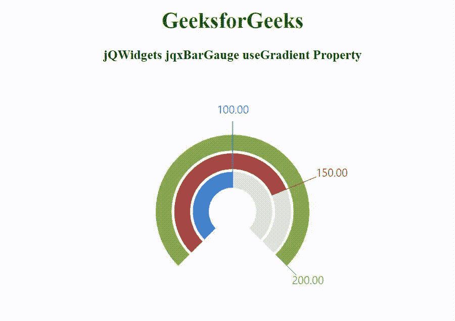

# jQWidgets jqxBarGauge 使用渐变属性

> 原文：[https://www.geeksforgeeks.org/jqwidgets-jqxbargauge-usegradient-property/](https://www.geeksforgeeks.org/jqwidgets-jqxbargauge-usegradient-property/)

**jQWidgets** 是一个 JavaScript 框架，用于为 PC 和移动设备制作基于 web 的应用程序。它是一个非常强大和优化的框架，独立于平台，并得到广泛支持。`jqxBarGauge` 表示一个 jQuery 条形图小部件，它为给定的值绘制一个条形图。

`useGradient` 属性用于设置或返回 `jqxBarGauge` 的使用渐变。在纯色或渐变之间更改线段的可视化效果。它接受布尔类型值，默认值为 `true`。

**语法：**

```javascript
$('.selector').jqxBarGauge({
  values: [array],
  useGradient: boolean
});
```

**链接文件：** 从链接下载 [**jQWidgets**](https://www.jqwidgets.com/download/) 。在 HTML 文件中，找到下载文件夹中的脚本文件。

```html
<link rel="stylesheet" href="jqwidgets/styles/jqx.base.css" type="text/css" />
<script type="text/javascript" src="scripts/jquery-1.11.1.min.js"></script>
<script type="text/javascript" src="jqwidgets/jqxcore.js"></script>
<script type="text/javascript" src="jqwidgets/jqxdraw.js"></script>
```

**示例：** 以下示例说明了 jQWidgets jqxBarGauge `useGradient` 属性。

## HTML

```html
<!DOCTYPE html>
<html lang="en">

<head>
    <link rel="stylesheet" 
          href="jqwidgets/styles/jqx.base.css" 
          type="text/css" />
    <script type="text/javascript" 
            src="scripts/jquery-1.11.1.min.js">
    </script>
    <script type="text/javascript" 
            src="jqwidgets/jqxcore.js">
    </script>
    <script type="text/javascript" 
            src="jqwidgets/jqxdraw.js">
    </script>
    <script type="text/javascript" 
            src="jqwidgets/jqxbargauge.js">
    </script>
</head>

<body>
    <center>
        <h1 style="color:green;">
            GeeksforGeeks
        </h1>
        <h3>
            jQWidgets jqxBarGauge useGradient Property
        </h3>
        <div id="gfg"></div>
    </center>

    <script type="text/javascript">
        $(document).ready(function () {
            $('#gfg').jqxBarGauge({
                values: [100, 150, 200],
                max: 200,
                useGradient: false
            });
        });
    </script>
</body>

</html>
```

**输出：**



**参考：** [https://www.jqwidgets.com/jquery-widgets-documentation/documentation/jqxbargauge/jquery-bar-gauge-api.htm](https://www.jqwidgets.com/jquery-widgets-documentation/documentation/jqxbargauge/jquery-bar-gauge-api.htm)