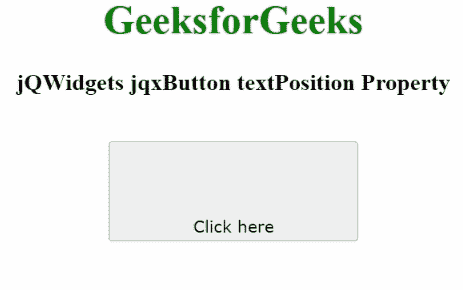

# jQWidgets jqxButton 文本位置属性

> 原文：[https://www.geeksforgeeks.org/jqwidgets-jqxbutton-textposition-property/](https://www.geeksforgeeks.org/jqwidgets-jqxbutton-textposition-property/)

**jQWidgets** 是一个 JavaScript 框架，用于为 PC 和移动设备制作基于 web 的应用程序。它是一个非常强大、优化、独立于平台并且得到广泛支持的框架。`jqxButton` 用于说明 jQuery 按钮小部件，它使我们能够在所需的网页上显示按钮。

**文本位置属性**用于设置或获取文本在显示按钮上的位置。它属于字符串类型，默认值为 `""`。

其可能值如下：
*   `left`
*   `top`
*   `center`
*   `bottom`
*   `right`
*   `topLeft`
*   `bottomLeft`
*   `topRight`
*   `bottomRight`

## 语法

设置 `textPosition` 属性。
```javascript
$('#jqxButton').jqxButton({textPosition: "left"}); 
```

获取 `textPosition` 属性。
```javascript
var textPosition = $('#jqxButton').jqxButton('textPosition');
```

## 链接文件

从链接下载 [jQWidgets](https://www.jqwidgets.com/download/)。在 HTML 文件中，找到下载文件夹中的脚本文件。
```html
<link rel="stylesheet" href="jqwidgets/styles/jqx.base.css" type="text/css" />
<script type="text/javascript" src="scripts/jquery-1.11.1.min.js"></script>
<script type="text/javascript" src="jqwidgets/jqxcore.js"></script>
<script type="text/javascript" src="jqwidgets/jqxbuttons.js"></script>
```

下面的例子说明了 jQWidgets 中的 `jqxButton` 的 `textPosition` 属性。

## 示例

### HTML
```html
<!DOCTYPE html>
<html lang="en">

<head>
    <link rel="stylesheet" 
          href="jqwidgets/styles/jqx.base.css" 
          type="text/css" />
    <script type="text/javascript" 
            src="scripts/jquery-1.11.1.min.js"></script>
    <script type="text/javascript" 
            src="jqwidgets/jqxcore.js"></script>
    <script type="text/javascript" 
            src="jqwidgets/jqxbuttons.js"></script>
</head>

<body>
    <center>
        <h1 style="color: green">GeeksforGeeks</h1>
        <h3>jQWidgets jqxButton textPosition Property</h3>
        <br />
        <input type="button" id="jqxBtn" 
               style="padding: 5px 20px" 
               value="Click here" />
        <div id="log"></div>
    </center>

    <script type="text/javascript">
        $(document).ready(function () {
            $("#jqxBtn").jqxButton({
                width: "200px",
                height: "80px",
                textPosition: "bottom",
            });

            $("#jqxBtn").on("click", function (event) {
                var tp = $("#jqxBtn").jqxButton("textPosition");
                $("#log").html("Position of text: " + tp);
            });
        });
    </script>
</body>

</html>
```

## 输出



## 参考
[https://www.jqwidgets.com/jquery-widgets-documentation/documentation/jqxbutton/jquery-button-api.htm](https://www.jqwidgets.com/jquery-widgets-documentation/documentation/jqxbutton/jquery-button-api.htm)