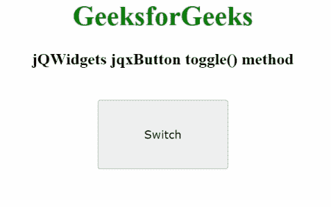

# jQWidgets jqxButton toggle()方法

> 原文：[https://www.geeksforgeeks.org/jqwidgets-jqxbutton-toggle-method/](https://www.geeksforgeeks.org/jqwidgets-jqxbutton-toggle-method/)

`jQWidgets`是一个JavaScript框架，用于为PC和移动设备制作基于web的应用程序。它是一个非常强大、优化、独立于平台并且得到广泛支持的框架。`jqxButton`用于说明jQuery按钮小部件，它使我们能够在所需的网页上显示按钮，`jqxToggleButton`用于说明jQuery按钮小部件，它在被点击后改变其验证状态。

`toggle()`方法用于切换显示按钮的验证状态。它可以在`jqxToggleButton`中访问。它没有参数，也不返回任何内容。

## 语法

```html
$('#jqxButton').jqxToggleButton('toggle'); 
```

## 链接文件

从链接下载[jQWidgets](https://www.jqwidgets.com/download/)。在HTML文件中，找到下载文件夹中的脚本文件。

```html
<link rel="stylesheet" href="jqwidgets/styles/jqx.base.css" type="text/css" />
<script type="text/javascript" src="scripts/jquery-1.11.1.min.js"></script>
<script type="text/javascript" src="jqwidgets/jqxcore.js"></script>
<script type="text/javascript" src="jqwidgets/jqxbuttons.js"></script>
```

## 示例

下面的示例说明了`jQWidgets`中的`jqxButton` `toggle()`方法。

### HTML

```html
<!DOCTYPE html>
<html lang="en">
  <head>
    <link
      rel="stylesheet"
      href="jqwidgets/styles/jqx.base.css"
      type="text/css"
    />
    <script type="text/javascript" 
        src="scripts/jquery-1.11.1.min.js"></script>
    <script type="text/javascript" 
        src="jqwidgets/jqxcore.js"></script>
    <script type="text/javascript" 
        src="jqwidgets/jqxbuttons.js"></script>
  </head>
  <body>
    <center>
      <h1 style="color: green">GeeksforGeeks</h1>
      <h3>jQWidgets jqxButton toggle() method</h3>
      <br />
      <input
        type="button"
        id="jqxBtn"
        style="padding: 5px 20px"
        value="Switch"
      />
      <div id="log"></div>
    </center>

<script type="text/javascript">
      $(document).ready(function () {
        $("#jqxBtn").jqxToggleButton({
          width: "150px",
          height: "80px",
        });

        $("#jqxBtn").on("click", function () {
          $("#jqxBtn").jqxToggleButton("toggle");
          $("#log").html("Button toggled");
        });
      });
    </script>
  </body>
</html>
```

## 输出



## 参考

[https://www.jqwidgets.com/jquery-widgets-documentation/documentation/jqxbutton/jquery-button-api.htm?search=](https://www.jqwidgets.com/jquery-widgets-documentation/documentation/jqxbutton/jquery-button-api.htm?search=)