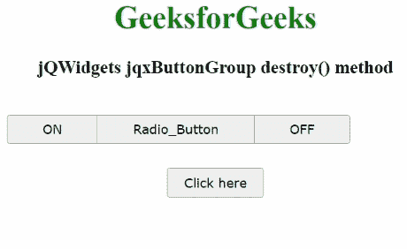

# jQWidgets jqxButtonGroup `destroy()`方法

> 原文：[https://www.geeksforgeeks.org/jqwidgets-jqxbuttongroup-destroy-method/](https://www.geeksforgeeks.org/jqwidgets-jqxbuttongroup-destroy-method/)

`jQWidgets`是一个JavaScript框架，用于为PC和移动设备制作基于web的应用程序。它是一个非常强大、优化、独立于平台并且得到广泛支持的框架。`jqxButtonGroup`用于说明jQuery小部件，它生成一组功能类似于普通按钮、单选按钮或复选框的按钮。

`destroy()`方法用于销毁显示的`jqxButtonGroup`。它没有参数，也不返回任何内容。

## 语法

```javascript
$('Selector').jqxButtonGroup('destroy'); 
```

## 链接文件

从给定链接下载[jQWidgets](https://www.jqwidgets.com/download/)。在HTML文件中，找到下载文件夹中的脚本文件。

```html
<link rel="stylesheet" href="jqwidgets/styles/jqx.base.css" type="text/css">
<script type="text/javascript" src="scripts/jquery-1.11.1.min.js"></script>
<script type="text/javascript" src="jqwidgets/jqxcore.js"></script>
<script type="text/javascript" src="jqwidgets/jqx-all.js"></script>
```

## 示例

下面的示例说明了`jQWidgets`中的`jqxButtonGroup`的`destroy()`方法。

### HTML

```html
<!DOCTYPE html>
<html lang="en">
  <head>
    <link
      rel="stylesheet"
      href="jqwidgets/styles/jqx.base.css"
      type="text/css"
    />
    <script type="text/javascript" 
        src="scripts/jquery-1.11.1.min.js"></script>
    <script type="text/javascript" 
        src="jqwidgets/jqxcore.js"></script>
    <script type="text/javascript" 
        src="jqwidgets/jqxbuttons.js"></script>
  </head>
  <body>
    <center>
      <h1 style="color: green">GeeksforGeeks</h1>
      <h3>jQWidgets jqxButtonGroup destroy() method</h3>
      <br />

      <div id="jqxBG">
        <button style="padding: 6px 36px" 
                id="l">ON</button>
        <button style="padding: 6px 36px" 
                id="c">Radio_Button</button>
        <button style="padding: 6px 36px" 
                id="r">OFF</button>
      </div>
      <div>
        <input
          type="button"
          id="jqxBtn"
          style="margin-top: 25px"
          value="Click here"
        />
      </div>
      <div id="log"></div>
    </center>

    <script type="text/javascript">
      $(document).ready(function () {
        $("#jqxBtn").jqxButton({
          width: "100px",
          height: "30px",
        });
        $("#jqxBG").jqxButtonGroup({});

        $("#jqxBtn").on("click", function () {
          $("#jqxBG").jqxButtonGroup("destroy");
          $("#log").text("Buttons destroyed");
        });
      });
    </script>
  </body>
</html>
```

## 输出



## 参考

[https://www.jqwidgets.com/jquery-widgets-documentation/documentation/jqxbutton/jquery-button-api.htm?search=](https://www.jqwidgets.com/jquery-widgets-documentation/documentation/jqxbutton/jquery-button-api.htm?search=)