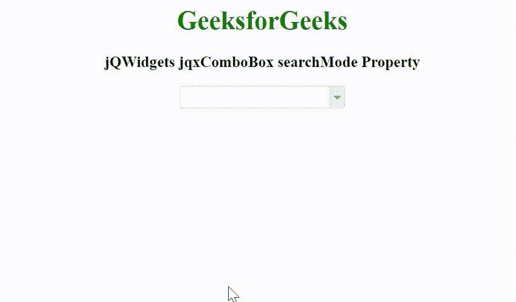

# jQWidgets jqxComboBox 搜索模式属性

> 原文：[https://www.geeksforgeeks.org/jqwidgets-jqxcombobox-searchmode-property/](https://www.geeksforgeeks.org/jqwidgets-jqxcombobox-searchmode-property/)

jQWidgets 是一个 JavaScript 框架，用于为 PC 和移动设备制作基于 web 的应用程序。它是一个非常强大和优化的框架，独立于平台，并得到广泛支持。`jqxComboBox` 用于表示一个 jQuery combobox 小部件，它包含一个具有自动完成功能的输入字段和一个显示在下拉列表中的可选项目列表。

`searchMode` 属性用于设置或返回项目搜索模式。当用户在编辑字段中键入内容时，此属性非常有用。它接受字符串类型值，默认值为 `"startswith"`。

它的可能值是：

*   `"none"`
*   `"contains"`
*   `"containsignorecase"`
*   `"equals"`
*   `"equalsignorecase"`
*   `"startswithignorecase"`
*   `"startswith"`
*   `"endswithignorecase"`
*   `"endswith"`

## 语法

设置 `searchMode` 属性。

```javascript
$('selector').jqxComboBox({ searchMode: String });
```

返回 `searchMode` 属性。

```javascript
var searchMode = $('selector').jqxComboBox('searchMode');
```

## 链接文件

从 [https://www.jqwidgets.com/download/](https://www.jqwidgets.com/download/) 链接下载 jQWidgets。在 HTML 文件中，找到下载文件夹中的脚本文件：

```html
<link rel="stylesheet" href="jqwidgets/styles/jqx.base.css" type="text/css" />
<script type="text/javascript" src="scripts/jquery-1.11.1.min.js"></script>
<script type="text/javascript" src="jqwidgets/jqx-all.js"></script>
<script type="text/javascript" src="jqwidgets/jqxcore.js"></script>
<script type="text/javascript" src="jqwidgets/jqxcolorpicker.js"></script>
<script type="text/javascript" src="jqwidgets/jqxbuttons.js"></script>
<script type="text/javascript" src="jqwidgets/jqxscrollbar.js"></script>
<script type="text/javascript" src="jqwidgets/jqxlistbox.js"></script>
<script type="text/javascript" src="jqwidgets/jqxcombobox.js"></script>
```

以下示例说明了 jQWidgets 中的 `jqxComboBox` `searchMode` 属性。

## 示例

### 超文本标记语言

```html
<!DOCTYPE html>
<html lang="en">

<head>
    <link rel="stylesheet" href=
        "jqwidgets/styles/jqx.base.css" type="text/css" />
    <script type="text/javascript" 
        src="scripts/jquery-1.11.1.min.js"></script>
    <script type="text/javascript" 
        src="jqwidgets/jqx-all.js"></script>
    <script type="text/javascript" 
        src="jqwidgets/jqxcore.js"></script>
    <script type="text/javascript" 
        src="jqwidgets/jqxcolorpicker.js"></script>
    <script type="text/javascript" 
        src="jqwidgets/jqxbuttons.js"></script>
    <script type="text/javascript" 
        src="jqwidgets/jqxscrollbar.js"></script>
    <script type="text/javascript" 
        src="jqwidgets/jqxlistbox.js"></script>
    <script type="text/javascript" 
        src="jqwidgets/jqxcombobox.js"></script>
</head>

<body>
    <center>
        <h1 style="color: green;">
            GeeksforGeeks
        </h1>

        <h3>
            jQWidgets jqxComboBox searchMode Property
        </h3>

        <div id='jqxCB'></div>
    </center>

    <script type="text/javascript">
        $(document).ready(function () {
            var data = [
                "Computer Science",
                "C Programming",
                "C++ Programming",
                "Java Programming",
                "Python Programming",
                "HTML",
                "CSS",
                "JavaScript",
                "jQuery",
                "PHP",
                "Bootstrap"
            ];

            $("#jqxCB").jqxComboBox({
                source: data,
                width: '200px',
                animationType: 'slide',
                searchMode: 'endswith',
                autoComplete:true
            });
        });
    </script>
</body>

</html>
```

**输出：**



**参考：**[https://www.jqwidgets.com/jquery-widgets-documentation/documentation/jqxcombobox/jquery-combobox-api.htm](https://www.jqwidgets.com/jquery-widgets-documentation/documentation/jqxcombobox/jquery-combobox-api.htm)