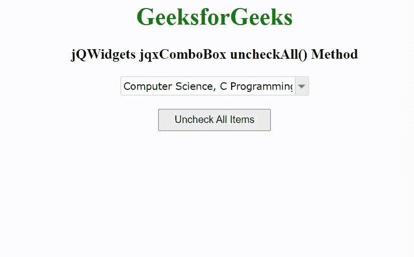

# jQWidgets jqxComboBox uncheckAll()方法

> 原文: [https://www.geeksforgeeks.org/jqwidgets-jqxcombobox-uncheckall-method/](https://www.geeksforgeeks.org/jqwidgets-jqxcombobox-uncheckall-method/)

jQWidgets 是一个 JavaScript 框架，用于为 PC 和移动设备制作基于 web 的应用程序。它是一个非常强大和优化的框架，独立于平台，并得到广泛支持。`jqxComboBox` 用于表示一个 jQuery Combobox 小部件，它包含一个具有自动完成功能的输入字段和一个显示在下拉列表中的可选项目列表。

当 `checkboxes` 属性值设置为 `true` 时，`uncheckAll()` 方法用于取消选中所有列表项。它不接受任何参数，也不返回值。

**语法:**

```javascript
$('selector').jqxComboBox('uncheckAll');
```

**链接文件:** 从 [https://www.jqwidgets.com/download/](https://www.jqwidgets.com/download/) 下载 jQWidgets。在 HTML 文件中，找到下载文件夹中的脚本文件:

```html
<link rel="stylesheet" href="jqwidgets/styles/jqx.base.css" type="text/css">
<script type="text/javascript" src="scripts/jquery-1.11.1.min.js"></script>
<script type="text/javascript" src="jqwidgets/jqx-all.js"></script>
<script type="text/javascript" src="jqwidgets/jqxcore.js"></script>
<script type="text/javascript" src="jqwidgets/jqxcolorpicker.js"></script>
<script type="text/javascript" src="jqwidgets/jqxbuttons.js"></script>
<script type="text/javascript" src="jqwidgets/jqxscrollbar.js"></script>
<script type="text/javascript" src="jqwidgets/jqxlistbox.js"></script>
<script type="text/javascript" src="jqwidgets/jqxcombobox.js"></script>
```

以下示例说明了 jQWidgets 中的 `jqxComboBox` `uncheckAll()` 方法:

## 示例

```html
<!DOCTYPE html>
<html lang="en">

<head>
    <link rel="stylesheet" href="jqwidgets/styles/jqx.base.css" type="text/css" />
    <script type="text/javascript" src="scripts/jquery-1.11.1.min.js"></script>
    <script type="text/javascript" src="jqwidgets/jqx-all.js"></script>
    <script type="text/javascript" src="jqwidgets/jqxcore.js"></script>
    <script type="text/javascript" src="jqwidgets/jqxcolorpicker.js"></script>
    <script type="text/javascript" src="jqwidgets/jqxbuttons.js"></script>
    <script type="text/javascript" src="jqwidgets/jqxscrollbar.js"></script>
    <script type="text/javascript" src="jqwidgets/jqxlistbox.js"></script>
    <script type="text/javascript" src="jqwidgets/jqxcombobox.js"></script>
</head>

<body>
    <center>
        <h1 style="color: green;">
            GeeksforGeeks
        </h1>
        <h3>
            jQWidgets jqxComboBox uncheckAll() Method
        </h3>
        <div id='jqxCB'></div>
        <br>
        <input type="button" id='jqxBtn' style="padding: 5px 20px;" value="Uncheck All Items" />
    </center>

    <script type="text/javascript">
        $(document).ready(function () {
            var data = [
                "Computer Science",
                "C Programming",
                "C++ Programming",
                "Java Programming",
                "Python Programming",
                "HTML",
                "CSS",
                "JavaScript",
                "jQuery",
                "PHP",
                "Bootstrap"
            ];

            $("#jqxCB").jqxComboBox({
                source: data,
                width: '250px',
                animationType: 'slide',
                checkboxes: true
            });

            $("#jqxCB").jqxComboBox('checkAll');

            $('#jqxBtn').on('click', function () {
                var index = $("#jqxCB").jqxComboBox('uncheckAll');
            });
        });
    </script>
</body>

</html>
```

**输出:**



**参考:** [https://www.jqwidgets.com/jquery-widgets-documentation/documentation/jqxcombobox/jquery-combobox-api.htm](https://www.jqwidgets.com/jquery-widgets-documentation/documentation/jqxcombobox/jquery-combobox-api.htm)