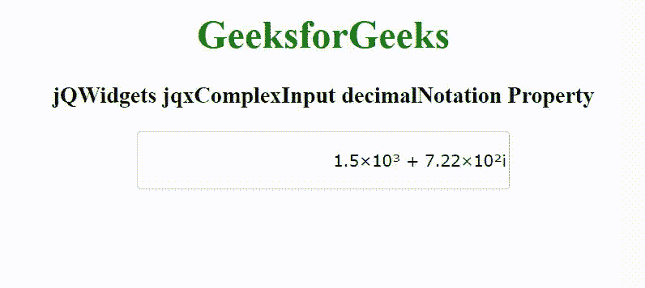

# jQWidgets jqxComplexInput decimalNotation 属性

> 原文: [https://www.geeksforgeeks.org/jqwidgets-jqxcomplexinput-decimalnotation-property/](https://www.geeksforgeeks.org/jqwidgets-jqxcomplexinput-decimalnotation-property/)

jQWidgets 是一个 JavaScript 框架，用于为 PC 和移动设备制作基于 web 的应用程序。它是一个非常强大和优化的框架，独立于平台，并得到广泛支持。`jqxComplexInput` 是一个 jQuery 输入小部件，用于输入包含实部和虚部的复数。

`decimalNotation` 属性用于设置或返回显示复数的实部和虚部的符号。它接受字符串类型值，其默认值为 `"default"`。

它的可能值是–
*   `"default"` – 默认值包含十进制表示法。例如– `"330000-200i"`
*   `"exponential"` – 它以指数形式表示日期。例如– `"3.3e+5-2e+2i"`
*   `"scientific"` – 它代表 10 的幂次数。例如– `'3.3×10⁵-2×10²i'`
*   `"engineering"` – 例如– `"330×10³-200×10⁰i"`

## 语法

设置 `decimalNotation` 属性。

```javascript
$('selector').jqxComplexInput({ decimalNotation: String });
```

返回 `decimalNotation` 属性。

```javascript
var decN = $('selector').jqxComplexInput('decimalNotation');
```

## 链接文件

从给定的链接 [https://www.jqwidgets.com/download/](https://www.jqwidgets.com/download/) 下载 jQWidgets。在 HTML 文件中，找到下载文件夹中的脚本文件。

```html
<link rel="stylesheet" href="jqwidgets/styles/jqx.base.css" type="text/css" />
<script type="text/javascript" src="scripts/jquery-1.11.1.min.js"></script>
<script type="text/javascript" src="jqwidgets/jqxcore.js"></script>
<script type="text/javascript" src="jqwidgets/jqx-all.js"></script>
```

下面的例子说明了 jQWidgets `jqxComplexInput` `decimalNotation` 属性。

## 示例

```html
<!DOCTYPE html>
<html lang="en">

<head>
    <link rel="stylesheet" href="jqwidgets/styles/jqx.base.css" type="text/css" />
    <script type="text/javascript" src="scripts/jquery-1.11.1.min.js"></script>
    <script type="text/javascript" src="jqwidgets/jqxcore.js"></script>
    <script type="text/javascript" src="jqwidgets/jqx-all.js"></script>
    <script type="text/javascript" src="jqwidgets/jqxcomplexinput.js"></script>
</head>

<body>
    <center>
        <h1 style="color: green;">
            GeeksforGeeks
        </h1>
        <h3>
            jQWidgets jqxComplexInput decimalNotation Property
        </h3>
        <input id="jqxCI" type="text" />
    </center>
    <script type="text/javascript">
        $(document).ready(function() {
            $("#jqxCI").jqxComplexInput({
                width: 300,
                height: 40,
                value: "1500 + 722i",
                decimalNotation: 'scientific'
            });
        });
    </script>
</body>

</html>
```

## 输出



## 参考

[https://www.jqwidgets.com/jquery-widgets-documentation/documentation/jqxcomplexinput/jquery-complex-input-api.htm](https://www.jqwidgets.com/jquery-widgets-documentation/documentation/jqxcomplexinput/jquery-complex-input-api.htm)