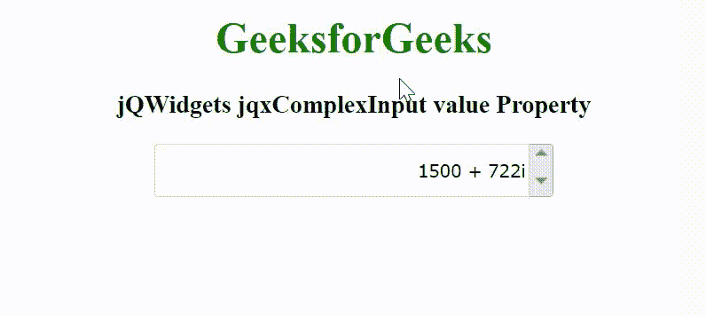

# jQWidgets jqxComplexInput 值属性

> 原文：[https://www.geeksforgeeks.org/jqwidgets-jqxcomplexinput-value-property/](https://www.geeksforgeeks.org/jqwidgets-jqxcomplexinput-value-property/)

jQWidgets 是一个 JavaScript 框架，用于为 PC 和移动设备制作基于 web 的应用程序。它是一个非常强大和优化的框架，独立于平台，并得到广泛支持。`jqxComplexInput` 是一个 jQuery 输入小部件，用于输入包含实部和虚部的复数。

`value` 属性用于设置或返回 `jqxComplexInput` 小部件的值。它接受字符串类型值，默认值为空”。

**语法：**

设置 `value` 属性。

```html
$('selector').jqxComplexInput({ value: String });
```

返回 `value` 属性。

```html
var value = $('selector').jqxComplexInput('value');
```

**链接文件：** 从给定的链接 [https://www.jqwidgets.com/download/](https://www.jqwidgets.com/download/) 下载 jQWidgets。在 HTML 文件中，找到下载文件夹中的脚本文件。

> `<link rel="stylesheet" href="jqwidgets/styles/jqx.base.css" type="text/css">`
> `<script type="text/javascript" src="scripts/jquery-1.11.1.min.js"></script>`
> `<script type="text/javascript" src="jqwidgets/jqxcore.js"></script>`
> `<script type="text/javascript" src="jqwidgets/jqx-all.js"></script>`

下面的示例说明了 jQWidgets `jqxComplexInput` `value` 属性。

### 示例

#### HTML

```html
<!DOCTYPE html>
<html lang="en">

<head>
    <link rel="stylesheet" href=
        "jqwidgets/styles/jqx.base.css" type="text/css" />
    <script type="text/javascript" 
        src="scripts/jquery-1.11.1.min.js"></script>
    <script type="text/javascript" 
        src="jqwidgets/jqxcore.js"></script>
    <script type="text/javascript" 
        src="jqwidgets/jqx-all.js"></script>
    <script type="text/javascript" 
        src="jqwidgets/jqxcomplexinput.js"></script>
</head>

<body>
    <center>
        <h1 style="color: green;">
            GeeksforGeeks
        </h1>
        <h3>
            jQWidgets jqxComplexInput value Property
        </h3>
        <div id="jqxCI">
            <input type="text" />
            <div></div>
        </div>
    </center>
    <script type="text/javascript">
        $(document).ready(function() {
            $("#jqxCI").jqxComplexInput({
                width: 300,
                height: 40,
                value: "1500 + 722i",
                spinButtons: true
            });
        });
    </script>
</body>

</html>
```

**输出：**



**参考：** [https://www.jqwidgets.com/jquery-widgets-documentation/documentation/jqxcomplexinput/jquery-complex-input-api.htm](https://www.jqwidgets.com/jquery-widgets-documentation/documentation/jqxcomplexinput/jquery-complex-input-api.htm)