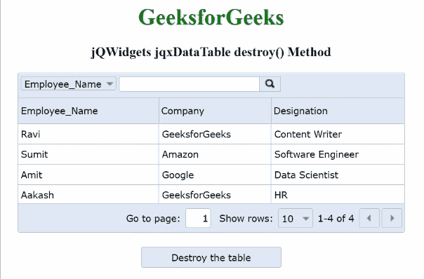

# jQWidgets jqxDataTable destroy()方法

> 原文：[https://www.geeksforgeeks.org/jqwidgets-jqxdatatable-destroy-method/](https://www.geeksforgeeks.org/jqwidgets-jqxdatatable-destroy-method/)

`jQWidgets`是一个JavaScript框架，用于为PC和移动设备制作基于web的应用程序。它是一个非常强大、优化、独立于平台并且得到广泛支持的框架。`jqxDataTable`用于读取和显示HTML表格中的数据。这也用于显示来自各种数据源的数据，如XML、JSON、Array、CSV或TSV。

`destroy()`方法用于销毁指定的`jqxDataTable`并将其从DOM中移除。此方法不接受任何参数。

## 语法

```html
$("#dataTable").jqxDataTable('destroy');
```

## 链接文件

从给定链接下载[https://www.jqwidgets.com/download/](https://www.jqwidgets.com/download/)。在HTML文件中，找到下载文件夹中的脚本文件。

```html
<link rel="stylesheet" href="jqwidgets/styles/jqx.base.css" type="text/css">
<script type="text/javascript" src="scripts/jquery.js"></script>
<script type="text/javascript" src="jqwidgets/jqxcore.js"></script>
<script type="text/javascript" src="jqwidgets/jqxdata.js"></script>
```

## 示例

下面的示例说明了`jQWidgets`的`destroy()`方法。

### HTML

```html
<!DOCTYPE html>
<html lang="en">

<head>
    <link rel="stylesheet" href="
         jqwidgets/styles/jqx.base.css" type="text/css" />
    <script type="text/javascript"
            src="scripts/jquery.js">
    </script>
    <script type="text/javascript" 
            src="jqwidgets/jqxcore.js">
    </script>
    <script type="text/javascript" 
            src="jqwidgets/jqxdata.js">
    </script>
    <script type="text/javascript" 
            src="jqwidgets/jqxbuttons.js">
    </script>
    <script type="text/javascript" 
            src="jqwidgets/jqxscrollbar.js">
    </script>
    <script type="text/javascript" 
            src="jqwidgets/jqxlistbox.js">
    </script>
    <script type="text/javascript" 
            src="jqwidgets/jqxdropdownlist.js">
    </script>
    <script type="text/javascript" 
            src="jqwidgets/jqxdatatable.js">
    </script>
    <script>
        $(document).ready(function () {
            var data = new Array();
            var Employee_Name = [
                "Ravi", "Sumit", "Amit", "Aakash"];
            var Company = [
                "GeeksforGeeks", "Amazon", "Google",
                "GeeksforGeeks"];
            var Designation = [
                "Content Writer", "Software Engineer",
                "Data Scientist", "HR"];

            let a = 0;
            while (a < 4) {
                var row = {};
                row["Employee_Name"] = Employee_Name[a];
                row["Company"] = Company[a];
                row["Designation"] = Designation[a]
                data[a] = row;
                a++;
            }

            var source = {
                localData: data,
                dataType: "array",
                dataFields: [{
                    name: 'Employee_Name',
                    type: 'string'
                }, {
                    name: 'Company',
                    type: 'string'
                }, {
                    name: 'Designation',
                    type: 'string'
                }]
            };
            var dataAdapter = new $.jqx.dataAdapter(source);
            $("#table").jqxDataTable({
                width: 550,
                theme: 'energyblue',
                source: dataAdapter,
                columns: [{
                    text: 'Employee_Name',
                    dataField: 'Employee_Name',
                    width: 200
                }, {
                    text: 'Company',
                    dataField: 'Company',
                    width: 160
                }, {
                    text: 'Designation',
                    dataField: 'Designation',
                    width: 190
                }]
            });
            $("#jqxbutton").jqxButton({
                theme: 'energyblue',
                width: 210,
                height: 30
            });
            $('#jqxbutton').click(function () {
                $("#table").jqxDataTable('destroy');
            });
        });
    </script>
</head>

<body>
    <center>
        <h1 style="color: green;"> 
          GeeksforGeeks 
        </h1>
        <h3> 
          jQWidgets jqxDataTable destroy() Method 
        </h3>
        <div id="table"></div>
        <input type="button" style="margin: 30px;" id="jqxbutton"
         value="Destroy the above Data Table" />
    </center>
</body>

</html>
```

## 输出



## 参考

[https://www.jqwidgets.com/jquery-widgets-documentation/documentation/jqxdatatable/jquery-datatable-api.htm?search=](https://www.jqwidgets.com/jquery-widgets-documentation/documentation/jqxdatatable/jquery-datatable-api.htm?search=)