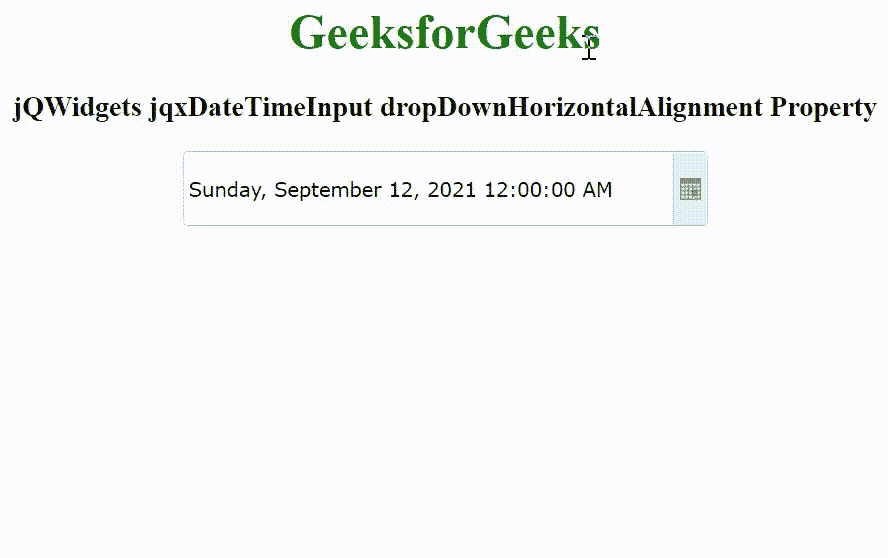

# jQWidgets jqxDateTimeInput dropDownHorizontalAlignment 属性

> 原文: [https://www.geeksforgeeks.org/jqwidgets-jqxdatetimeinput-dropdownhorizontalalignment-property/](https://www.geeksforgeeks.org/jqwidgets-jqxdatetimeinput-dropdownhorizontalalignment-property/)

jQWidgets 是一个 JavaScript 框架，用于为 PC 和移动设备制作基于 web 的应用程序。它是一个非常强大、优化、独立于平台并且得到广泛支持的框架。`jqxDateTimeInput` 小部件是一个 jQuery datetimeinput，用于使用显示的日历或键盘选择日期或时间。

`dropDownHorizontalAlignment` 属性用于设置或返回下拉水平对齐。它接受字符串类型值，默认值为“左”。

它的可能值是–

*   `left`
*   `right`

## 语法

设置 `dropDownHorizontalAlignment` 属性。

```javascript
$('selector').jqxDateTimeInput({
             dropDownHorizontalAlignment: String });
```

返回 `dropDownHorizontalAlignment` 属性。

```javascript
var ADHA = $('selector').
         jqxDateTimeInput('dropDownHorizontalAlignment');
```

## 链接文件

从链接 [https://www.jqwidgets.com/download/](https://www.jqwidgets.com/download/) 下载 jQWidgets。在 HTML 文件中，找到下载文件夹中的脚本文件。

```html
<link rel="stylesheet" href="jqwidgets/styles/jqx.base.css" type="text/css">
<link rel="stylesheet" href="jqwidgets/styles/jqx.energyblue.css" type="text/css">
<script type="text/javascript" src="scripts/jquery-1.11.1.min.js"></script>
<script type="text/javascript" src="jqwidgets/jqxcore.js"></script>
```

下面的例子说明了 jQWidgets 中的 `jqxDateTimeInput` `dropDownHorizontalAlignment` 属性。

## 示例

```html
<!DOCTYPE html>
<html lang="en">

<head>
    <link rel="stylesheet" href=
        "jqwidgets/styles/jqx.base.css" type="text/css" />
    <link rel="stylesheet" href=
        "jqwidgets/styles/jqx.energyblue.css" type="text/css" />
    <script type="text/javascript" 
        src="scripts/jquery-1.11.1.min.js"></script>
    <script type="text/javascript" 
        src="jqwidgets/jqxcore.js"></script>
    <script type="text/javascript" 
        src="jqwidgets/jqxdatetimeinput.js"></script>
    <script type="text/javascript" 
        src="jqwidgets/jqxcalendar.js"></script>
    <script type="text/javascript" 
        src="jqwidgets/jqxtooltip.js"></script>
    <script type="text/javascript" 
        src="jqwidgets/jqxbuttons.js"></script>
    <script type="text/javascript" src=
        "jqwidgets/globalization/globalize.js"></script>
</head>

<body>
    <center>
        <h1 style="color: green;">
            GeeksforGeeks
        </h1>

        <h3>
            jQWidgets jqxDateTimeInput 
            dropDownHorizontalAlignment Property
        </h3>

        <div style="margin: 10px;" id='jqxDTI'></div>
    </center>

    <script type="text/javascript">
        $(document).ready(function() {
            $("#jqxDTI").jqxDateTimeInput({
                theme: 'energyblue',
                width: '350px',
                height: '50px',
                formatString: "F",
                dropDownHorizontalAlignment: 'right'
            });
        });
    </script>
</body>

</html>
```

## 输出



## 参考

[https://www.jqwidgets.com/jquery-widgets-documentation/documentation/jqxdatetimeinput/jquery-datetimeinput-api.htm](https://www.jqwidgets.com/jquery-widgets-documentation/documentation/jqxdatetimeinput/jquery-datetimeinput-api.htm)