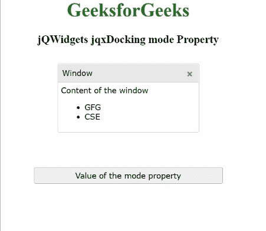

# jQWidgets jqxDocking mode 属性

> 原文: [https://www.geeksforgeeks.org/jqwidgets-jqxdocking-mode-property/](https://www.geeksforgeeks.org/jqwidgets-jqxdocking-mode-property/)

`jQWidgets` 是一个 JavaScript 框架，用于为 PC 和移动设备制作基于 web 的应用程序。它是一个非常强大、优化、独立于平台并且得到广泛支持的框架。`jqxDocking` 用于表示一个小部件来管理多个窗口以及一个网页的布局。在这里，指定的 `jqxDocking` 中的每个窗口都可以执行多个任务，例如可以在网页上拖动、停靠到停靠区域、从停靠中移除、折叠到最小化状态以隐藏其内容，还可以展开以显示其内容。

## mode 属性

`mode` 属性用于设置或获取指定 `jqxDocking` 的模式。此属性接受三个可能的值，如下所示:

*   `"default"`: 使用该值，用户可以将每个窗口放置在任何停靠面板内或停靠面板外。
*   `"docked"`: 使用该值，用户可以将每个窗口拖放到停靠面板中。
*   `"floating"`: 使用该值，用户可以将任何窗口放置在停靠面板的外部。

## 语法

*   用于设置 `mode` 属性:

```javascript
$('#jqxDocking').jqxDocking({ mode: 'floating' });
```

*   获取 `mode` 属性:

```javascript
var mode = $('#jqxDocking').jqxDocking('mode');
```

## 链接文件

从给定链接下载 [https://www.jqwidgets.com/download/](https://www.jqwidgets.com/download/)。在 HTML 文件中，找到下载文件夹中的脚本文件。

```html
<link rel="stylesheet" href="jqwidgets/styles/jqx.base.css" type="text/css">
<script type="text/javascript" src="scripts/jquery.js"></script>
<script type="text/javascript" src="jqwidgets/jqxcore.js"></script>
<script type="text/javascript" src="jqwidgets/jqxdocking.js"></script>
```

## 示例

以下示例说明了 `jQWidgets` `mode` 属性。在下面的例子中，`mode` 属性的值被设置为 `"floating"`。

### HTML

```html
<!DOCTYPE html>
<html lang="en">

<head>
    <link rel="stylesheet"
          href="jqwidgets/styles/jqx.base.css"
          type="text/css"/>
    <script type="text/javascript"
            src="scripts/jquery.js">
    </script>
    <script type="text/javascript"
            src="jqwidgets/jqxcore.js">
    </script>
    <script type="text/javascript"
            src="jqwidgets/jqxdocking.js">
    </script>
    <script type="text/javascript"
            src="jqwidgets/jqxwindow.js">
    </script>
</head>

<body>
    <center>
        <h1 style="color: green;">
            GeeksforGeeks
        </h1>
        <h3>
            jQWidgets jqxDocking mode Property
        </h3>
        <div id="jqx_Docking" style="margin: 25px;"
             align="left">
            <div>
                <div id="Window">
                    <div>Window</div>
                    <div>
                        <h8>Content of the window</h8>
                        <ul>
                            <li>GFG</li>
                            <li>CSE</li>
                        </ul>
                    </div>
                </div>
            </div>
        </div>
        <input type="button" style="margin: 29px;"
               id="jqxbutton_for_mode"
               value="Value of the mode property"/>
        <div id="log"></div>
        <script type="text/javascript">
            $(document).ready(function () {
                $("#jqx_Docking").jqxDocking({
                    width: 250,
                    mode: 'floating'
                });
                $("#jqxbutton_for_mode").
                    jqxButton({
                        width: 320
                    });
                $('#jqxbutton_for_mode').on(
                    'click', function () {
                        var Value_of_mode =
                        $('#jqx_Docking').jqxDocking(
                                'mode');
                        $("#log").html(JSON.stringify(
                            Value_of_mode));
                    });
            });
        </script>
    </center>
</body>

</html>
```

## 输出



## 参考

[https://www.jqwidgets.com/jquery-widgets-documentation/documentation/jqxdocking/jquery-docking-api.htm?search=](https://www.jqwidgets.com/jquery-widgets-documentation/documentation/jqxdocking/jquery-docking-api.htm?search=)