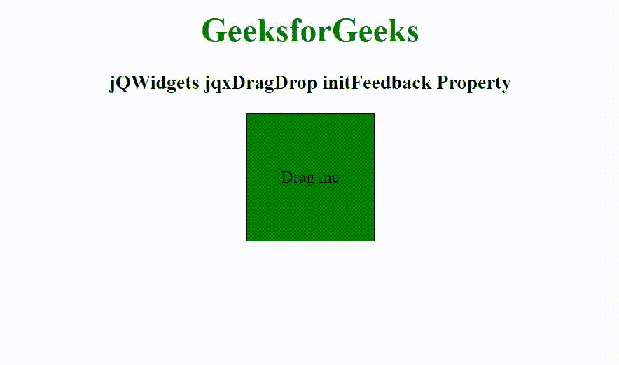

# jQWidgets jqxDragDrop initFeedback 属性

> 原文: [https://www.geeksforgeeks.org/jqwidgets-jqxdragdrop-initfeedback-property/](https://www.geeksforgeeks.org/jqwidgets-jqxdragdrop-initfeedback-property/)

**jQWidgets** 是一个 JavaScript 框架，用于为 PC 和移动设备制作基于 web 的应用程序。它是一个非常强大、优化、独立于平台并且得到广泛支持的框架。`jqxDragDrop` 用于表示一个 jQuery 拖放小部件，该部件用于使任何 DOM 元素可拖动。它可以与许多小部件结合使用，如 `jqxTree`、`jqxGrid`、`jqxListBox` 等。

`initFeedback` 属性用于设置或返回创建反馈时正在执行的回调。接受函数类型值，默认值为 `null`。

## 语法

设置 `initFeedback` 属性。

```javascript
$('selector').jqxDragDrop({ initFeedback: function(feedback) { 
    feedback.width(300); 
} });
```

返回 `initFeedback` 属性。

```javascript
var initFeedback = $('selector').jqxDragDrop('initFeedback');
```

## 链接文件

从链接下载 [jQWidgets](https://www.jqwidgets.com/download/)。在 HTML 文件中，找到下载文件夹中的脚本文件。

```html
<link rel="stylesheet" href="jqwidgets/styles/jqx.base.css" type="text/css">
<script type="text/javascript" src="scripts/jquery-1.11.1.min.js"></script>
<script type="text/javascript" src="jqwidgets/jqx-all.js"></script>
<script type="text/javascript" src="jqwidgets/jqxcore.js"></script>
```

## 示例

以下示例说明了 jQWidgets 中的 `jqxDragDrop` `initFeedback` 属性。

### HTML

```html
<!DOCTYPE html>
<html lang="en">

<head>
    <link rel="stylesheet" href="jqwidgets/styles/jqx.base.css" type="text/css" />
    <script type="text/javascript" src="scripts/jquery-1.11.1.min.js"></script>
    <script type="text/javascript" src="jqwidgets/jqx-all.js"></script>
    <script type="text/javascript" src="jqwidgets/jqxcore.js"></script>
    <script type="text/javascript" src="jqwidgets/jqxdragdrop.js"></script>
</head>

<body class='default'>
    <center>
        <h1 style="color: green;">
            GeeksforGeeks
        </h1>
        <h3>
            jQWidgets jqxDragDrop initFeedback Property
        </h3>
        <div style="width: 120px; height: 120px; border: 1px solid black; background-color: green;" id="divID">
            <div style="display: flex; justify-content: center; align-items: center; height: 100%;">
                Drag me
            </div>
        </div>
    </center>

    <script type="text/javascript">
        $(document).ready(function() {
            $("#divID").jqxDragDrop({
                initFeedback: function (feedback) {
                    feedback.css({
                        background: 'blue',
                        color: 'white',
                    });
                    feedback.text('Div is dragging');  
                }
            });
        });
    </script>
</body>
</html>
```

### 输出



### 参考

[https://www.jqwidgets.com/jquery-widgets-documentation/documentation/jqxdragdrop/jquery-dragdrop-api.htm](https://www.jqwidgets.com/jquery-widgets-documentation/documentation/jqxdragdrop/jquery-dragdrop-api.htm)