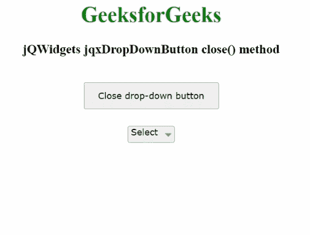

# jQWidgets jqxDropDownButton close()方法

> 原文: [https://www.geeksforgeeks.org/jqwidgets-jqxdropdownbutton-close-method/](https://www.geeksforgeeks.org/jqwidgets-jqxdropdownbutton-close-method/)

`jQWidgets` 是一个 JavaScript 框架，用于为 PC 和移动设备制作基于 web 的应用程序。它是一个非常强大、优化、独立于平台并且得到广泛支持的框架。`jqxDropDownButton` 用于说明一个 jQuery 小部件，该部件包含显示在下拉按钮中的许多可选择的以及可扩展的项目。

`close()` 方法用于关闭显示的下拉按钮的内容。它没有参数，也不返回任何内容。

## 语法

```javascript
$('Selector').jqxDropDownButton('close');
```

## 链接文件

从链接下载 [jQWidgets](https://www.jqwidgets.com/download/) 。在 HTML 文件中，找到下载文件夹中的脚本文件。

```html
<link rel="stylesheet" href="jqwidgets/styles/jqx.base.css" type="text/css" />
<script type="text/javascript" src="scripts/jquery-1.11.1.min.js"></script>
<script type="text/javascript" src="jqwidgets/jqxcore.js"></script>
<script type="text/javascript" src="jqwidgets/jqxbuttons.js"></script>
```

## 示例

下面的示例说明了 `jQWidgets` 中的 `jqxDropDownButton` `close()`方法。

### 超文本标记语言

```html
<!DOCTYPE html>
<html lang="en">
  <head>
    <link
      rel="stylesheet"
      href="jqwidgets/styles/jqx.base.css"
      type="text/css"
    />
    <script type="text/javascript" src="scripts/jquery-1.11.1.min.js"></script>
    <script type="text/javascript" src="jqwidgets/jqxcore.js"></script>
    <script type="text/javascript" src="jqwidgets/jqxbuttons.js"></script>
  </head>

  <body>
    <center>
      <h1 style="color: green">GeeksforGeeks</h1>
      <h3>jQWidgets jqxDropDownButton close() method</h3>
      <br />
      <div>
        <input
          type="button"
          id="jqxBtn"
          style="margin-bottom: 25px"
          value="Close drop-down button"
        />
      </div>
      <div style="float: center" id="jqxDdB">
        <div id="jqxT">
          <ul>
            <li>GFG</li>
            <li>
              Languages
              <ul>
                <li>C</li>
                <li>Java</li>
              </ul>
            </li>
            <li>
              Subjects
              <ul>
                <li>Data Structutre</li>
                <li>Algorithm</li>
              </ul>
            </li>
          </ul>
        </div>
      </div>
      <div id="log"></div>
    </center>

    <script type="text/javascript">
      $(document).ready(function () {
        $("#jqxBtn").jqxButton({
          width: "200px",
          height: "40px",
        });

        $("#jqxDdB").jqxDropDownButton({
          height: "25px",
          width: "70px",
        });
        $("#jqxT").jqxTree({});
        $("#jqxDdB").jqxDropDownButton("setContent", "Select");

        $("#jqxBtn").on("click", function () {
          $("#jqxDdB").jqxDropDownButton("close");
          $("#log").html("Button closed");
        });
      });
    </script>
  </body>
</html>
```

## 输出



## 参考

[https://www.jqwidgets.com/jquery-widgets-documentation/documentation/jqxbutton/jquery-button-api.htm?search=](https://www.jqwidgets.com/jquery-widgets-documentation/documentation/jqxbutton/jquery-button-api.htm?search=)