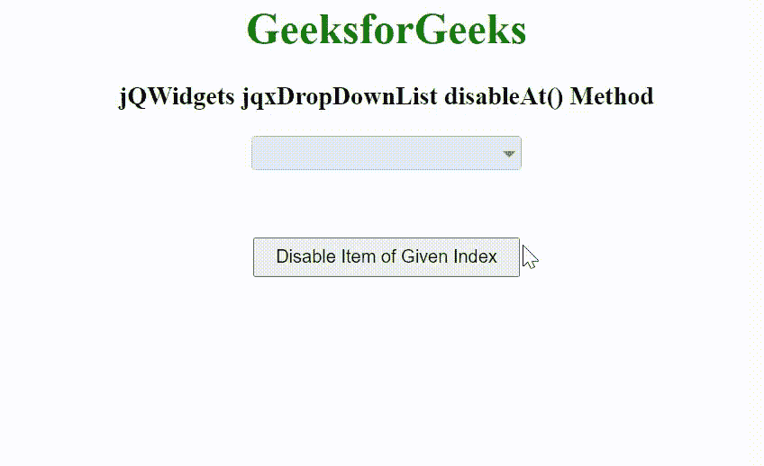

# jQWidgets jqxDropDownList disableAt()方法

> 原文: [https://www.geeksforgeeks.org/jqwidgets-jqxdropdownlist-disableat-method/](https://www.geeksforgeeks.org/jqwidgets-jqxdropdownlist-disableat-method/)

## 简介
`jQWidgets`是一个JavaScript框架，用于为PC和移动设备制作基于web的应用程序。它是一个非常强大、优化、独立于平台并且得到广泛支持的框架。`jqxDropDownList`小部件是一个jQuery下拉列表，其中包含下拉列表中显示的可选项目列表。

`disableAt()`方法用于通过索引号禁用项目。它接受数字类型的单个参数索引，并且不返回任何值。索引从0开始。

## 语法
```javascript
$("Selector").jqxDropDownList('disableAt', index );
```

## 链接文件
从链接下载[jQWidgets](https://www.jqwidgets.com/download/)。在HTML文件中，找到下载文件夹中的脚本文件。

```html
<link rel="stylesheet" href="jqwidgets/styles/jqx.base.css" type="text/css">
<link rel="stylesheet" href="jqwidgets/styles/jqx.energyblue.css">
<script type="text/javascript" src="scripts/jquery-1.11.1.min.js"></script>
<script type="text/javascript" src="jqwidgets/jqx-all.js"></script>
```

## 示例
下面的示例说明了`jQWidgets`中的`jqxDropDownList` `disableAt()`方法。

### HTML
```html
<!DOCTYPE html>
<html lang="en">

<head>
    <link rel="stylesheet" href=
        "jqwidgets/styles/jqx.base.css" type="text/css" />
    <link rel="stylesheet" href=
        "jqwidgets/styles/jqx.energyblue.css">
    <script type="text/javascript" 
        src="scripts/jquery-1.11.1.min.js"></script>
    <script type="text/javascript" 
        src="jqwidgets/jqx-all.js"></script>
    <script type="text/javascript" 
        src="jqwidgets/jqxcore.js"></script>
    <script type="text/javascript" 
        src="jqwidgets/jqxbuttons.js"></script>
    <script type="text/javascript" 
        src="jqwidgets/jqxscrollbar.js"></script>
    <script type="text/javascript" 
        src="jqwidgets/jqxlistbox.js"></script>
    <script type="text/javascript" 
        src="jqwidgets/jqxdropdownlist.js"></script>
</head>

<body>
    <center>
        <h1 style="color: green;">
            GeeksforGeeks
        </h1>

        <h3>
            jQWidgets jqxDropDownList disableAt() Method
        </h3>

        <div id='jqxDDL'></div>

        <input id="jqxBtn" type="button" 
            value="Disable Item of Given Index" 
            style="padding: 5px 15px; margin-top: 50px;">
    </center>

    <script type="text/javascript">
        $(document).ready(function() {
            var data = [
                "Computer Science",
                "C Programming",
                "C++ Programming",
                "Java Programming",
                "Python Programming",
                "HTML",
                "CSS",
                "JavaScript",
                "jQuery",
                "PHP",
                "Bootstrap"
            ];

            $("#jqxDDL").jqxDropDownList({
                source: data,
                theme: 'energyblue'
            });

            $("#jqxBtn").on('click', function() {
                $("#jqxDDL").jqxDropDownList(
                    'disableAt', 4
                );
            });
        });
    </script>
</body>

</html>
```

## 输出


## 参考
[https://www.jqwidgets.com/jquery-widgets-documentation/documentation/jqxdropdownlist/jquery-dropdownlist-api.htm](https://www.jqwidgets.com/jquery-widgets-documentation/documentation/jqxdropdownlist/jquery-dropdownlist-api.htm)