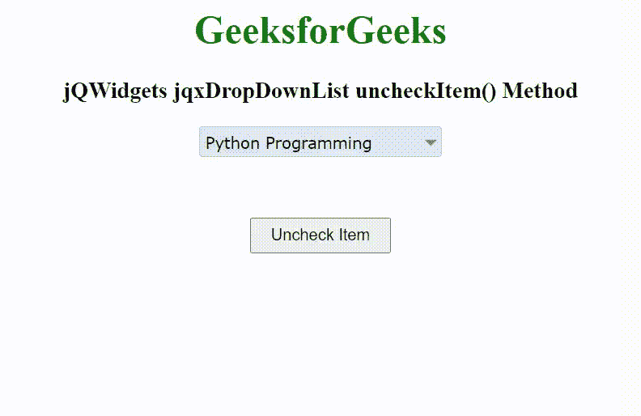

# jQWidgets jqxDropDownList uncheckItem()方法

> 原文: [https://www.geeksforgeeks.org/jqwidgets-jqxdropdownlist-uncheckitem-method/](https://www.geeksforgeeks.org/jqwidgets-jqxdropdownlist-uncheckitem-method/)

jQWidgets 是一个 JavaScript 框架，用于为 PC 和移动设备制作基于 web 的应用程序。它是一个非常强大、优化、独立于平台并且得到广泛支持的框架。`jqxDropDownList` 小部件是一个 jQuery 下拉列表，其中包含下拉列表中显示的可选项目列表。

`uncheckItem()` 方法用于在 `checkboxes` 属性值设置为 `true` 时，使用项目名称取消选中列表项目。它接受对象/字符串类型的单个参数 `item`，并且不返回值。

**语法:**

```javascript
$("Selector").jqxDropDownList('uncheckItem', item);
```

**链接文件:** 从链接 [https://www.jqwidgets.com/download/](https://www.jqwidgets.com/download/) 下载 jQWidgets。在 HTML 文件中，找到下载文件夹中的脚本文件。

```html
<link rel="stylesheet" href="jqwidgets/styles/jqx.base.css" type="text/css">
<link rel="stylesheet" href="jqwidgets/styles/jqx.energyblue.css">
<script type="text/javascript" src="scripts/jquery-1.11.1.min.js"></script>
<script type="text/javascript" src="jqwidgets/jqx-all.js"></script>
```

下面的例子说明了 jQWidgets 中的 `jqxDropDownList` `uncheckItem()` 方法。

## 示例

### 超文本标记语言

```html
<!DOCTYPE html>
<html lang="en">

<head>
    <link rel="stylesheet" href=
        "jqwidgets/styles/jqx.base.css" type="text/css" />
    <link rel="stylesheet" href=
        "jqwidgets/styles/jqx.energyblue.css">
    <script type="text/javascript" 
        src="scripts/jquery-1.11.1.min.js"></script>
    <script type="text/javascript" 
        src="jqwidgets/jqx-all.js"></script>
    <script type="text/javascript" 
        src="jqwidgets/jqxcore.js"></script>
    <script type="text/javascript" 
        src="jqwidgets/jqxbuttons.js"></script>
    <script type="text/javascript" 
        src="jqwidgets/jqxscrollbar.js"></script>
    <script type="text/javascript" 
        src="jqwidgets/jqxlistbox.js"></script>
    <script type="text/javascript" 
        src="jqwidgets/jqxdropdownlist.js"></script>
</head>

<body>
    <center>
        <h1 style="color: green;">
            GeeksforGeeks
        </h1>

        <h3>
            jQWidgets jqxDropDownList uncheckItem() Method
        </h3>

        <div id='jqxDDL'></div>

        <input id="jqxBtn" type="button" 
            value="Uncheck Item" 
            style="padding: 5px 15px; margin-top: 50px;">
    </center>

    <script type="text/javascript">
        $(document).ready(function() {
            var data = [
                "Computer Science",
                "C Programming",
                "C++ Programming",
                "Java Programming",
                "Python Programming",
                "HTML",
                "CSS",
                "JavaScript",
                "jQuery",
                "PHP",
                "Bootstrap"
            ];

            $("#jqxDDL").jqxDropDownList({
                source: data,
                theme: 'energyblue',
                checkboxes: true
            });

            $("#jqxDDL").jqxDropDownList('checkIndex', 4);

            $("#jqxBtn").on('click', function() {
                $("#jqxDDL").jqxDropDownList(
                    'uncheckItem', "Python Programming");
            });
        });
    </script>
</body>

</html>
```

**输出:**



**参考:** [https://www.jqwidgets.com/jquery-widgets-documentation/documentation/jqxdropdownlist/jquery-dropdownlist-api.htm](https://www.jqwidgets.com/jquery-widgets-documentation/documentation/jqxdropdownlist/jquery-dropdownlist-api.htm)