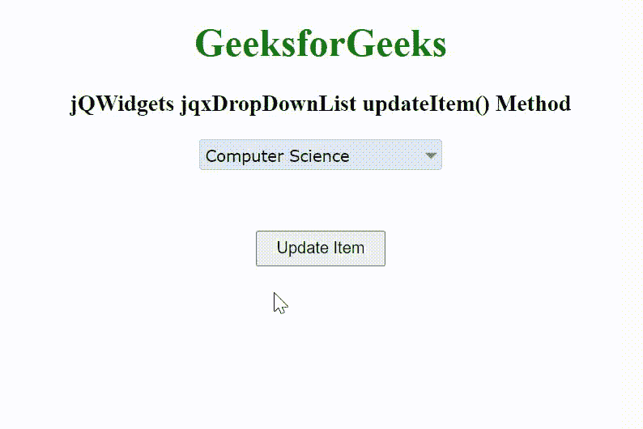

# jqwidgets jqxdropsdownlist update item()方法

> 原文: [https://www.geeksforgeeks.org/jqwidgets-jqxdropdownlist-updateitem-method/](https://www.geeksforgeeks.org/jqwidgets-jqxdropdownlist-updateitem-method/)

jQWidgets 是一个 JavaScript 框架，用于为 PC 和移动设备制作基于 web 的应用程序。它是一个非常强大、优化、独立于平台并且得到广泛支持的框架。`jqxDropDownList` 小部件是一个 jQuery 下拉列表，其中包含下拉列表中显示的可选项目列表。

`updateItem()`方法用于向下拉列表中更新一个新项目。它接受字符串/对象类型的两个参数`new item`和`item`，并且不返回值。

该项目具有以下字段:

*   `label` – 指定物品的标签。
*   `value` – 指定项目的值。
*   `disabled` – 指定项目是否启用/禁用。
*   `checked` – 指定项目是否已勾选/未勾选。
*   `hasThreeStates` – 指定复选框项支持三种状态。
*   `html` – 指定 HTML 中的显示项。它可以用来代替标签。
*   `index` – 指定项目索引号。
*   `group` – 指定项目的组。

## 语法

```html
$("Selector").jqxDropDownList('updateItem', 'new item', 'old item');
```

## 链接文件

从链接 [https://www.jqwidgets.com/download/](https://www.jqwidgets.com/download/) 下载 jQWidgets。在 HTML 文件中，找到下载文件夹中的脚本文件。

```html
<link rel="stylesheet" href="jqwidgets/styles/jqx.base.css" type="text/css">
<link rel="stylesheet" href="jqwidgets/styles/jqx.energyblue.css">
<script type="text/javascript" src="scripts/jquery-1.11.1.min.js"></script>
<script type="text/javascript" src="jqwidgets/jqx-all.js"></script>
```

下面的例子说明了 jQWidgets 中的 `jqxDropDownList` `updateItem()`方法。

## 示例

```html
<!DOCTYPE html>
<html lang="en">

<head>
    <link rel="stylesheet" href=
        "jqwidgets/styles/jqx.base.css" type="text/css" />
    <link rel="stylesheet" href=
        "jqwidgets/styles/jqx.energyblue.css">
    <script type="text/javascript" 
        src="scripts/jquery-1.11.1.min.js"></script>
    <script type="text/javascript" 
        src="jqwidgets/jqx-all.js"></script>
    <script type="text/javascript" 
        src="jqwidgets/jqxcore.js"></script>
    <script type="text/javascript" 
        src="jqwidgets/jqxbuttons.js"></script>
    <script type="text/javascript" 
        src="jqwidgets/jqxscrollbar.js"></script>
    <script type="text/javascript" 
        src="jqwidgets/jqxlistbox.js"></script>
    <script type="text/javascript" 
        src="jqwidgets/jqxdropdownlist.js"></script>
</head>

<body>
    <center>
        <h1 style="color: green;">
            GeeksforGeeks
        </h1>

        <h3>
            jQWidgets jqxDropDownList updateItem() Method
        </h3>

        <div id='jqxDDL'></div>

        <input id="jqxBtn" type="button" 
            value="Update Item" 
            style="padding: 5px 15px; margin-top: 50px;">
    </center>

    <script type="text/javascript">
        $(document).ready(function() {
            var data = [
                "Computer Science",
                "C Programming",
                "C++ Programming",
                "Java Programming",
                "Python Programming",
                "HTML",
                "CSS",
                "JavaScript",
                "jQuery",
                "PHP",
                "Bootstrap"
            ];

            $("#jqxDDL").jqxDropDownList({
                source: data,
                theme: 'energyblue',
                selectedIndex: 0
            });

            $("#jqxBtn").on('click', function() {
                $("#jqxDDL").jqxDropDownList(
                    'updateItem', "Python Programming", 
                    "Computer Science");
            });
        });
    </script>
</body>

</html>
```

## 输出



## 参考

[https://www.jqwidgets.com/jquery-widgets-documentation/documentation/jqxdropdownlist/jquery-dropdownlist-api.htm](https://www.jqwidgets.com/jquery-widgets-documentation/documentation/jqxdropdownlist/jquery-dropdownlist-api.htm)