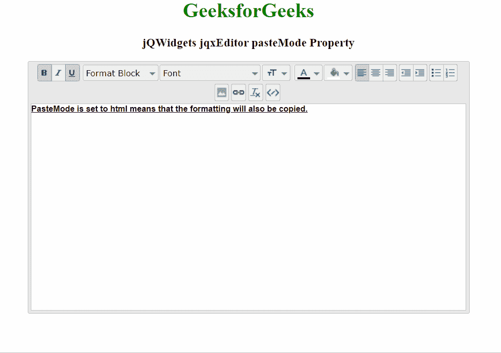

# jQWidgets jqxEditor 粘贴模式属性

> 原文：[https://www.geeksforgeeks.org/jqwidgets-jqxeditor-pastemode-property/](https://www.geeksforgeeks.org/jqwidgets-jqxeditor-pastemode-property/)

**jQWidgets** 是一个 JavaScript 框架，用于为 PC 和移动设备制作基于 web 的应用程序。它是一个非常强大、优化、独立于平台并且得到广泛支持的框架。`jqxEditor` 用于表示 jQuery HTML 文本编辑器，可用于简化网页内容创建，也可用于替代 HTML 文本区域。

**粘贴模式属性**用于设置或返回粘贴模式属性。即编辑器的 `pasteMode` 可以使用该属性进行设置。它接受字符串类型值，默认值为“html”。

## 语法

设置*粘贴模式*属性。

```javascript
$('Selector').jqxEditor({ pasteMode : "html" });
```

返回*粘贴模式*属性。

```javascript
var pasteMode = $('Selector').jqxEditor('pasteMode');
```

## 链接文件

从链接下载 [jQWidgets](https://www.jqwidgets.com/download/)。在 HTML 文件中，找到下载文件夹中的脚本文件：

```html
<link rel="stylesheet" href="jqwidgets/styles/jqx.base.css" type="text/css">
<script type="text/javascript" src="scripts/jquery-1.11.1.min.js"></script>
<script type="text/javascript" src="jqwidgets/jqxcore.js"></script>
<script type="text/javascript" src="jqwidgets/jqxbuttons.js"></script>
<script type="text/javascript" src="jqwidgets/jqxscrollbar.js"></script>
<script type="text/javascript" src="jqwidgets/jqxlistbox.js"></script>
<script type="text/javascript" src="jqwidgets/jqxdropdownlist.js"></script>
<script type="text/javascript" src="jqwidgets/jqxdropdownbutton.js"></script>
<script type="text/javascript" src="jqwidgets/jqxcolorpicker.js"></script>
<script type="text/javascript" src="jqwidgets/jqxwindow.js"></script>
<script type="text/javascript" src="jqwidgets/jqxeditor.js"></script>
<script type="text/javascript" src="jqwidgets/jqxtooltip.js"></script>
<script type="text/javascript" src="jqwidgets/jqxcheckbox.js"></script>
```

以下示例说明了 jQWidgets 中的 `jqxEditor` **粘贴模式属性**：

## 示例

### HTML

```html
<!DOCTYPE html>
<html lang="en">
<head>
    <link rel="stylesheet"
          href="jqwidgets/styles/jqx.base.css"
          type="text/css" />
    <script type="text/javascript"
            src="scripts/jquery-1.11.1.min.js">
      </script>
    <script type="text/javascript"
            src="jqwidgets/jqxcore.js">
      </script>
    <script type="text/javascript"
            src="jqwidgets/jqxbuttons.js">
      </script>
    <script type="text/javascript"
            src="jqwidgets/jqxscrollbar.js">
      </script>
    <script type="text/javascript"
            src="jqwidgets/jqxlistbox.js">
      </script>
    <script type="text/javascript"
            src="jqwidgets/jqxdropdownlist.js">
      </script>
    <script type="text/javascript"
            src="jqwidgets/jqxdropdownbutton.js">
      </script>
    <script type="text/javascript"
            src="jqwidgets/jqxcolorpicker.js">
      </script>
    <script type="text/javascript"
            src="jqwidgets/jqxwindow.js">
      </script>
    <script type="text/javascript"
            src="jqwidgets/jqxeditor.js">
      </script>
    <script type="text/javascript"
            src="jqwidgets/jqxtooltip.js">
      </script>
    <script type="text/javascript"
            src="jqwidgets/jqxcheckbox.js">
      </script>
</head>

<body>
    <center>
        <h1 style="color: green;">
              GeeksforGeeks
          </h1>

<h3>jQWidgets jqxEditor pasteMode Property</h3>
        <textarea id="editor">
        </textarea>
    </center>

<script type="text/javascript">
        $(document).ready(function () {
            $('#editor').jqxEditor({
                height: "400px",
                width: '700px',
                pasteMode:"html"
            });
        });
    </script>

</body>
</html>
```

### 输出



## 参考

[https://www.jqwidgets.com/jquery-widgets-documentation/documentation/jqxeditor/jquery-editor-api.htm](https://www.jqwidgets.com/jquery-widgets-documentation/documentation/jqxeditor/jquery-editor-api.htm)