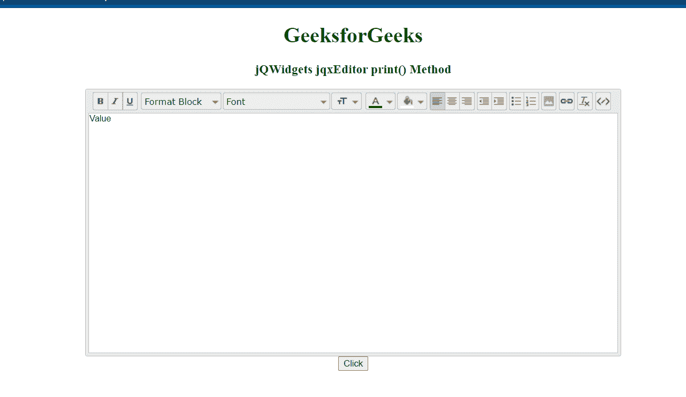

# jQWidgets jqxEditor print()方法

> 原文：[https://www.geeksforgeeks.org/jqwidgets-jqxeditor-print-method/](https://www.geeksforgeeks.org/jqwidgets-jqxeditor-print-method/)

`jQWidgets`是一个JavaScript框架，用于为PC和移动设备制作基于web的应用程序。它是一个非常强大、优化、独立于平台并且得到广泛支持的框架。`jqxEditor`用于表示jQuery HTML文本编辑器，该编辑器可用于简化网页内容创建，也可用于替代HTML文本区域。

`print()`方法用于打印`jqxEditor`小部件的值，我们也可以将其保存为PDF格式。它不接受任何参数，也不返回值。

## 语法

```javascript
$('Selector').jqxEditor('print');
```

## 链接文件

从[https://www.jqwidgets.com/download/](https://www.jqwidgets.com/download/)下载`jQWidgets`。在HTML文件中，找到下载文件夹中的脚本文件：

```html
<link rel="stylesheet" href="jqwidgets/styles/jqx.base.css" type="text/css" />
<script type="text/javascript" src="scripts/jquery-1.11.1.min.js"></script>
<script type="text/javascript" src="jqwidgets/jqxcore.js"></script>
<script type="text/javascript" src="jqwidgets/jqxbuttons.js"></script>
<script type="text/javascript" src="jqwidgets/jqxscrollbar.js"></script>
<script type="text/javascript" src="jqwidgets/jqxlistbox.js"></script>
<script type="text/javascript" src="jqwidgets/jqxdropdownlist.js"></script>
<script type="text/javascript" src="jqwidgets/jqxdropdownbutton.js"></script>
<script type="text/javascript" src="jqwidgets/jqxcolorpicker.js"></script>
<script type="text/javascript" src="jqwidgets/jqxwindow.js"></script>
<script type="text/javascript" src="jqwidgets/jqxeditor.js"></script>
<script type="text/javascript" src="jqwidgets/jqxtooltip.js"></script>
<script type="text/javascript" src="jqwidgets/jqxcheckbox.js"></script>
```

以下示例说明了`jQWidgets`中的`jqxEditor` `print()`方法：

## 示例

```html
<!DOCTYPE html>
<html lang="en">

<head>
    <link rel="stylesheet" href=
        "jqwidgets/styles/jqx.base.css" type="text/css" />
    <script type="text/javascript" 
        src="scripts/jquery-1.11.1.min.js"></script>
    <script type="text/javascript" 
        src="jqwidgets/jqxcore.js"></script>
    <script type="text/javascript" 
        src="jqwidgets/jqxbuttons.js"></script>
    <script type="text/javascript" 
        src="jqwidgets/jqxscrollbar.js"></script>
    <script type="text/javascript" 
        src="jqwidgets/jqxlistbox.js"></script>
    <script type="text/javascript" 
        src="jqwidgets/jqxdropdownlist.js"></script>
    <script type="text/javascript" 
        src="jqwidgets/jqxdropdownbutton.js"></script>
    <script type="text/javascript" 
        src="jqwidgets/jqxcolorpicker.js"></script>
    <script type="text/javascript" 
        src="jqwidgets/jqxwindow.js"></script>
    <script type="text/javascript" 
        src="jqwidgets/jqxeditor.js"></script>
    <script type="text/javascript" 
        src="jqwidgets/jqxtooltip.js"></script>
    <script type="text/javascript" 
        src="jqwidgets/jqxcheckbox.js"></script>
</head>

<body>
    <center>
        <h1 style="color: green;">
            GeeksforGeeks
        </h1>

        <h3>jQWidgets jqxEditor print() Method</h3>
        <textarea id="editor">
        </textarea>
        <button id="d" >Click</button>
    </center>

    <script type="text/javascript">
        $(document).ready(function () {
            $('#editor').jqxEditor({
                height: "400px",
                width: '800px'
             });
        });
        $("#d").click(function () {
            $('#editor').jqxEditor('print');
        });
    </script>
</body>
</html>
```

## 输出



## 参考

[https://www.jqwidgets.com/jquery-widgets-documentation/jqxeditor/jquery-editor-api.htm](https://www.jqwidgets.com/jquery-widgets-documentation/jqxeditor/jquery-editor-api.htm)