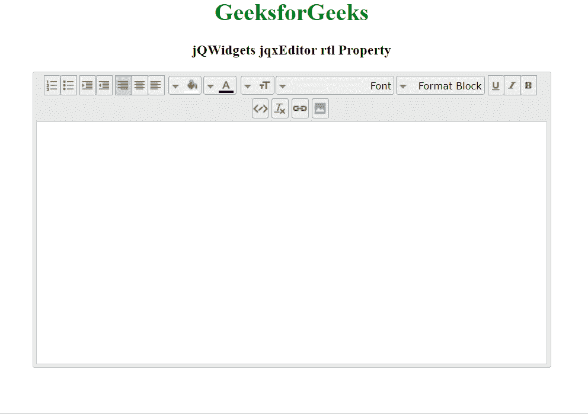

# jQWidgets jqxEditor rtl 属性

> 原文：[https://www.geeksforgeeks.org/jqwidgets-jqxeditor-rtl-property/](https://www.geeksforgeeks.org/jqwidgets-jqxeditor-rtl-property/)

jQWidgets 是一个 JavaScript 框架，用于为 PC 和移动设备制作基于 web 的应用程序。它是一个非常强大、优化、独立于平台并且得到广泛支持的框架。`jqxEditor` 用于表示 jQuery HTML 文本编辑器，该编辑器可用于简化网页内容创建，也可用于替代 HTML 文本区域。

`rtl` 属性用于设置或返回 `rtl` 属性，即该属性可用于向左或向右对齐文本。它接受布尔类型值，默认值为 `false`。

## 语法

设置 `rtl` 属性。

```html
$('Selector').jqxEditor({ rtl : true});  
```

获取 `rtl` 属性。

```javascript
var rtl = $('Selector').jqxEditor('rtl');
```

## 链接文件

从链接下载 [jQWidgets](https://www.jqwidgets.com/download/)。在 HTML 文件中，找到下载文件夹中的脚本文件：

> <link rel="stylesheet" href="jqwidgets/styles/jqx.base.css" type="text/css">
> <script type="text/javascript" src="scripts/jquery-1.11.1.min.js"></script>
> <script type="text/javascript" src="jqwidgets/jqxcore.js"></script>
> <script type="text/javascript" src="jqwidgets/jqxbuttons.js"></script>
> <script type="text/javascript" src="jqwidgets/jqxeditor.js"></script>
> <script type="text/javascript" src="jqwidgets/jqxtooltip.js"></script>
> <script type="text/javascript" src="jqwidgets/jqxc..."></script>

以下示例说明了 jQWidgets 中的 `jqxEditor` `rtl` 属性：

## 示例

### HTML

```html
<!DOCTYPE html>
<html lang="en">
<head>
    <link rel="stylesheet"
          href="jqwidgets/styles/jqx.base.css"
          type="text/css" />
    <script type="text/javascript"
               src="scripts/jquery-1.11.1.min.js">
      </script>
    <script type="text/javascript"
            src="jqwidgets/jqxcore.js">
      </script>
    <script type="text/javascript"
            src="jqwidgets/jqxbuttons.js">
      </script>
    <script type="text/javascript"
            src="jqwidgets/jqxscrollbar.js">
      </script>
    <script type="text/javascript"
            src="jqwidgets/jqxlistbox.js">
      </script>
    <script type="text/javascript"
            src="jqwidgets/jqxdropdownlist.js">
      </script>
    <script type="text/javascript"
            src="jqwidgets/jqxdropdownbutton.js">
      </script>
    <script type="text/javascript"
            src="jqwidgets/jqxcolorpicker.js">
      </script>
    <script type="text/javascript"
            src="jqwidgets/jqxwindow.js">
      </script>
    <script type="text/javascript"
            src="jqwidgets/jqxeditor.js">
      </script>
    <script type="text/javascript"
            src="jqwidgets/jqxtooltip.js">
      </script>
    <script type="text/javascript"
            src="jqwidgets/jqxcheckbox.js">
      </script>
</head>

<body>
    <center>
        <h1 style="color: green;">
              GeeksforGeeks
          </h1>

<h3>jQWidgets jqxEditor rtl Property</h3>

<textarea id="editor">
        </textarea>
    </center>

<script type="text/javascript">
        $(document).ready(function () {
            $('#editor').jqxEditor({
                height: "400px",
                width: '700px',
                rtl: true
            });
        });
    </script>

</body>
</html>
```

## 输出



## 参考

[https://www.jqwidgets.com/jquery-widgets-documentation/documentation/jqxeditor/jquery-editor-api.htm](https://www.jqwidgets.com/jquery-widgets-documentation/documentation/jqxeditor/jquery-editor-api.htm)