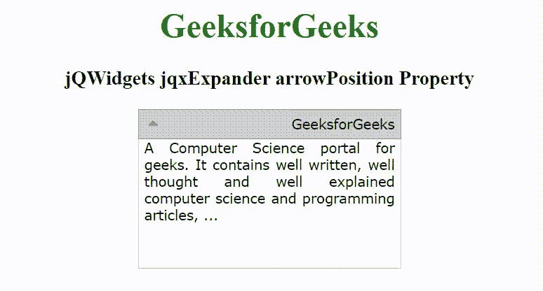

# jQWidgets jqxExpander 箭头位置属性

> 原文: [https://www.geeksforgeeks.org/jqwidgets-jqxexpander-arrowposition-property/](https://www.geeksforgeeks.org/jqwidgets-jqxexpander-arrowposition-property/)

jQWidgets 是一个 JavaScript 框架，用于为 PC 和移动设备制作基于 web 的应用程序。它是一个非常强大和优化的框架，独立于平台，并得到广泛支持。`jqxExpander` 代表一个 jQuery 小部件，显示标题和内容部分。单击标题部分展开或折叠内容。

`arrowPosition` 属性用于设置或返回表头的箭头位置。它接受字符串类型值，默认值为“左”。

它的可能值是–

*   `left`
*   `right`

## 语法

设置 `arrowPosition` 属性。

```javascript
$('selector').jqxExpander({ arrowPosition: String });
```

返回 `arrowPosition` 属性。

```javascript
var arrowPosition = $('selector').jqxExpander('arrowPosition');
```

## 链接文件

从给定的链接 [https://www.jqwidgets.com/download/](https://www.jqwidgets.com/download/) 下载 jQWidgets。在 HTML 文件中，找到下载文件夹中的脚本文件。

```html
<link rel="stylesheet" href="jqwidgets/styles/jqx.base.css" type="text/css">
<link rel="stylesheet" href="jqwidgets/styles/jqx.energyblue.css" type="text/css">
<script type="text/javascript" src="scripts/jquery-1.11.1.min.js"></script>
<script type="text/javascript" src="jqwidgets/jqx-all.js"></script>
```

下面的例子说明了 jQWidgets `jqxExpander` `arrowPosition` 属性。

## 示例

```html
<!DOCTYPE html>
<html lang="en">

<head>
    <link rel="stylesheet" href=
        "jqwidgets/styles/jqx.base.css" type="text/css" />
    <link rel="stylesheet" href="
        jqwidgets/styles/jqx.energyblue.css" type="text/css" />
    <script type="text/javascript" 
        src="scripts/jquery-1.11.1.min.js"></script>
    <script type="text/javascript" 
        src="jqwidgets/jqx-all.js"></script>
    <script type="text/javascript" 
        src="jqwidgets/jqxcore.js"></script>
    <script type="text/javascript" 
        src="jqwidgets/jqxexpander.js"></script>
</head>

<body>
    <center>
        <h1 style="color: green;">
            GeeksforGeeks
        </h1>

        <h3>
            jQWidgets jqxExpander arrowPosition Property
        </h3>

        <div id='jqxExp'>
            <div>GeeksforGeeks</div>

            <div style="text-align: justify;">
                A Computer Science portal for geeks. It 
                contains well written, well thought and 
                well explained computer science and 
                programming articles, ...
            </div>
        </div>
    </center>

    <script type="text/javascript">
        $(document).ready(function() {
            $("#jqxExp").jqxExpander({ 
                width: 250, 
                height: 150,
                arrowPosition: 'left'
            });
        });
    </script>
</body>

</html>
```

## 输出



## 参考

[https://www.jqwidgets.com/jquery-widgets-documentation/documentation/jqxexpander/jquery-expander-api.htm](https://www.jqwidgets.com/jquery-widgets-documentation/documentation/jqxexpander/jquery-expander-api.htm)