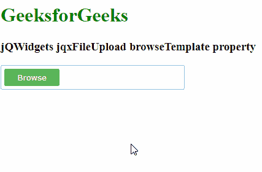

# jQWidgets jqxFileUpload browseTemplate 属性

> 原文: [https://www.geeksforgeeks.org/jqwidgets-jqxfileupload-browsetemplate-property/](https://www.geeksforgeeks.org/jqwidgets-jqxfileupload-browsetemplate-property/)

**jQWidgets** 是一个 JavaScript 框架，用于为 PC 和移动设备制作基于 web 的应用程序。它是一个非常强大和优化的框架，独立于平台，并得到广泛支持。**jqxFileUpload** 是一个小部件，可以用来选择文件并上传到服务器。

**browseTemplate** 属性用于设置或返回应用于“浏览”按钮的模板。它接受字符串类型的值，默认值为 `''`。可能的值有 `default`、`primary`、`success`、`warning`、`danger`、`inverse`、`info` 和 `link`。

## 语法

*   设置 `browseTemplate` 属性:
```html
$('Selector').jqxFileUpload({ browseTemplate : string });
```

*   返回 `browseTemplate` 属性:
```javascript
var browseTemplate = $('Selector').jqxFileUpload('browseTemplate');
```

## 链接文件

从给定链接下载 [jQWidgets](https://www.jqwidgets.com/download/)。在 HTML 文件中，找到下载文件夹中的脚本文件:
```html
<link type="text/css" rel="Stylesheet" href="jqwidgets/styles/jqx.base.css">
<script type="text/javascript" src="scripts/jquery-1.11.1.min.js"></script>
<script type="text/javascript" src="jqwidgets/jqxcore.js"></script>
<script type="text/javascript" src="jqwidgets/jqxbuttons.js"></script>
```

## 示例

以下示例说明了 jQWidgets 中的 jqxFileUpload **browseTemplate** 属性:

### HTML

```html
<!DOCTYPE html>
<html lang="en">

<head>
    <link type="text/css" rel="Stylesheet" 
          href="jqwidgets/styles/jqx.base.css" />
    <script type="text/javascript" 
            src="scripts/jquery-1.11.1.min.js">
    </script>
    <script type="text/javascript" 
            src="jqwidgets/jqxcore.js">
    </script>
    <script type="text/javascript" 
            src="jqwidgets/jqxbuttons.js">
    </script>
    <script type="text/javascript" 
            src="jqwidgets/jqxfileupload.js">
    </script>
</head>

<body>
    <h1 style="color: green">
        GeeksforGeeks 
    </h1>

    <h3>jQWidgets jqxFileUpload browseTemplate property</h3>

    <div id="gfg"> </div>

    <script type="text/javascript">
        $(document).ready(function () {
            $('#gfg').jqxFileUpload({ 
                theme: 'energyblue',
                width: 300,
                uploadUrl: 'upload.php',
                fileInputName: 'fileInput',
                browseTemplate: 'success'
            });
        });
    </script>
</body>

</html>
```

**输出:**



**参考:** [https://www.jqwidgets.com/jquery-widgets-documentation/documentation/jqxfileupload/jquery-file-upload-api.htm](https://www.jqwidgets.com/jquery-widgets-documentation/documentation/jqxfileupload/jquery-file-upload-api.htm)