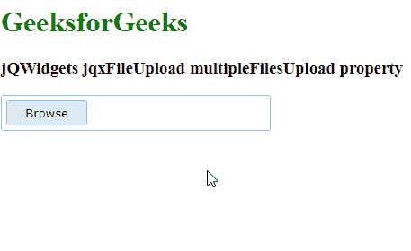

# jQWidgets jqxFileUpload multipleFilesUpload Property

> 原文: [https://www.geeksforgeeks.org/jqwidgets-jqxfileupload-multiplefilesupload-property/](https://www.geeksforgeeks.org/jqwidgets-jqxfileupload-multiplefilesupload-property/)

`jQWidgets` 是一个 JavaScript 框架，用于为 PC 和移动设备制作基于 web 的应用程序。它是一个非常强大、优化、独立于平台并且得到广泛支持的框架。`jqxFileUpload` 是一个小部件，可以用来选择文件并上传到服务器。

`multipleFilesUpload` 属性用于启用或禁用是否允许多文件上传。它接受布尔类型值，默认值为 `true`。

**语法:**

*   设置 `multipleFilesUpload` 属性。

```javascript
$('Selector').jqxFileUpload({ multipleFilesUpload : boolean });
```

*   返回 `multipleFilesUpload` 属性。

```javascript
var multipleFilesUpload = 
    $('Selector').jqxFileUpload('multipleFilesUpload');
```

**链接文件:** [从链接下载](https://www.jqwidgets.com/download/)。在 HTML 文件中，找到下载文件夹中的脚本文件。

```html
<link type="text/css" rel="Stylesheet" href="jqwidgets/styles/jqx.base.css">
<script type="text/javascript" src="scripts/jquery-1.11.1.min.js"></script>
<script type="text/javascript" src="jqwidgets/jqxcore.js"></script>
<script type="text/javascript" src="jqwidgets/jqxbuttons.js"></script>
```

**示例:** 下面的示例说明了 `jQWidgets` 中的 `jqxFileUpload` `multipleFilesUpload` 属性。

## HTML

```html
<!DOCTYPE html>
<html lang="en">

<head>
    <link type="text/css" rel="Stylesheet" 
          href="jqwidgets/styles/jqx.base.css" />
    <script type="text/javascript" 
            src="scripts/jquery-1.11.1.min.js">
    </script>
    <script type="text/javascript" 
            src="jqwidgets/jqxcore.js">
    </script>
    <script type="text/javascript" 
            src="jqwidgets/jqxbuttons.js">
    </script>
    <script type="text/javascript" 
            src="jqwidgets/jqxfileupload.js">
    </script>
</head>

<body>
    <h1 style="color:green">
          GeeksforGeeks
    </h1>

<h3>jQWidgets jqxFileUpload multipleFilesUpload property</h3>

<div id="gfg"> </div>

<script type="text/javascript">
        $(document).ready(function () {
            $('#gfg').jqxFileUpload({ 
                theme: 'energyblue',
                width: 300,
                uploadUrl: 'upload.php',
                multipleFilesUpload: false
            });
        });
    </script>
</body>  
</html>
```

**输出:**



**参考:** [https://www.jqwidgets.com/jquery-widgets-documentation/documentation/jqxfileupload/jquery-file-upload-api.htm](https://www.jqwidgets.com/jquery-widgets-documentation/documentation/jqxfileupload/jquery-file-upload-api.htm)