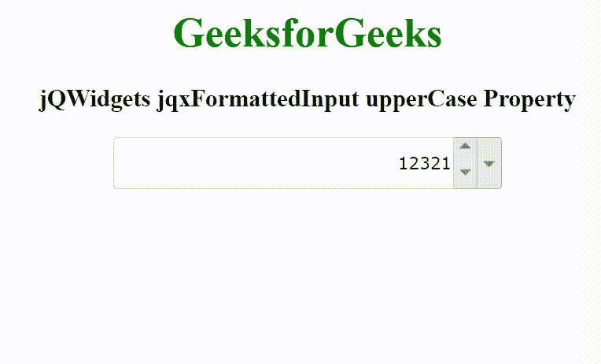

# jQWidgets jqxFormattedInput upperCase 属性

> 原文: [https://www.geeksforgeeks.org/jqwidgets-jqxformattedinput-uppercase-property/](https://www.geeksforgeeks.org/jqwidgets-jqxformattedinput-uppercase-property/)

jQWidgets 是一个 JavaScript 框架，用于为 PC 和移动设备制作基于 web 的应用程序。它是一个非常强大和优化的框架，独立于平台，并得到广泛支持。`jqxFormattedInput` 是一个 jQuery 输入小部件，用于输入二进制、八进制、十进制或十六进制格式的数字。可以通过可选的旋转按钮增加/减少输入数字，也可以通过可选的弹出菜单改变数字系统。

当 `radix` 属性设置为 `16` 或 `"hexadecimal"` 时，`upperCase` 属性用于设置或返回大写字符。它接受布尔类型值，默认值为 `false`。

## 语法

设置 `upperCase` 属性。

```javascript
$('selector').jqxFormattedInput({ upperCase: Boolean });
```

返回 `upperCase` 属性。

```javascript
var upperCase = $('selector').jqxFormattedInput('upperCase');
```

## 链接文件

从给定的链接 [https://www.jqwidgets.com/download/](https://www.jqwidgets.com/download/) 下载 jQWidgets。在 HTML 文件中，找到下载文件夹中的脚本文件。

```html
<link rel="stylesheet" href="jqwidgets/styles/jqx.base.css" type="text/css" />
<link rel="stylesheet" href="jqwidgets/styles/jqx.energyblue.css" type="text/css" />
<script type="text/javascript" src="scripts/jquery-1.11.1.min.js"></script>
<script type="text/javascript" src="jqwidgets/jqxcore.js"></script>
```

下面的例子说明了 jQWidgets `jqxFormattedInput` `upperCase` 属性。

## 示例

### HTML

```html
<!DOCTYPE html>
<html lang="en">

<head>
    <link rel="stylesheet" href=
        "jqwidgets/styles/jqx.base.css" type="text/css" />
    <link rel="stylesheet" href=
        "jqwidgets/styles/jqx.energyblue.css" type="text/css" />
    <script type="text/javascript" 
        src="scripts/jquery-1.11.1.min.js"></script>
    <script type="text/javascript" 
        src="jqwidgets/jqxcore.js"></script>
    <script type="text/javascript" 
        src="jqwidgets/jqxformattedinput.js"></script>
</head>

<body>
    <center>
        <h1 style="color: green;">
            GeeksforGeeks
        </h1>
        <h3>
            jQWidgets jqxFormattedInput upperCase Property
        </h3>
        <div id="jqxFI">
            <input type="text" />
            <div></div>
            <div></div>
        </div>
    </center>

    <script type="text/javascript">
        $(document).ready(function() {
            $("#jqxFI").jqxFormattedInput({
                width: 300,
                height: 40,
                radix: "decimal",
                value: "12321",
                spinButtons: true,
                dropDown: true,
                upperCase: true
            });
        });
    </script>
</body>

</html>
```

## 输出



## 参考

[https://www.jqwidgets.com/jquery-widgets-documentation/documentation/jqxformattedinput/jquery-formatted-input-api.htm](https://www.jqwidgets.com/jquery-widgets-documentation/documentation/jqxformattedinput/jquery-formatted-input-api.htm)