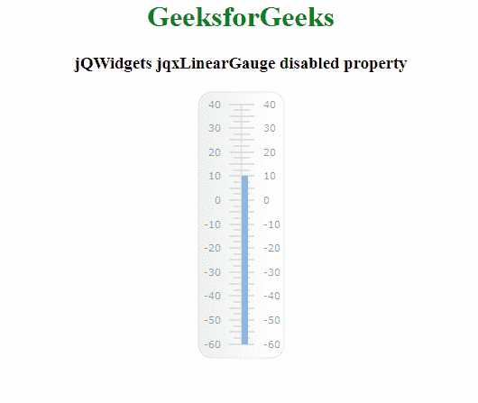

# jQWidgets jqxLinearGauge disabled 属性

> 原文: [https://www.geeksforgeeks.org/jqwidgets-jqxgauge-lineargauge-disabled-property/](https://www.geeksforgeeks.org/jqwidgets-jqxgauge-lineargauge-disabled-property/)

**jQWidgets** 是一个 JavaScript 框架，用于为 PC 和移动设备制作基于 web 的应用程序。它是一个非常强大、优化、独立于平台且得到广泛支持的框架。`jqxGauge` 代表一个 jQuery gauge 小部件，它是一个值范围内的指示器。我们可以使用仪表来显示数据区域中一系列值中的一个值，有两种类型的仪表:径向仪表和线性仪表。在**线性仪表**中，数值由一些数值以垂直方式线性表示。

## disabled 属性

`disabled` 属性用于设置或返回线性仪表是否被禁用。它接受布尔类型值，默认值为 `false`。

**语法:**

设置 `disabled` 属性。

```javascript
$('Selector').jqxLinearGauge({ disabled : boolean});
```

返回 `disabled` 属性。

```javascript
var disabled = $('Selector').jqxLinearGauge('disabled');
```

**链接文件:** 从链接下载 [jQWidgets](https://www.jqwidgets.com/download/)。在 HTML 文件中，找到下载文件夹中的脚本文件。

```html
<link rel="stylesheet" href="jqwidgets/styles/jqx.base.css" type="text/css" />
<script type="text/javascript" src="scripts/jquery-1.11.1.min.js"></script>
<script type="text/javascript" src="jqwidgets/jqxcore.js"></script>
<script type="text/javascript" src="jqwidgets/jqxchart.js"></script>
```

**示例:** 以下示例说明了 jQWidgets 中的 `jqxLinearGauge` `disabled` 属性。

## HTML

```html
<!DOCTYPE html>
<html lang="en">

<head>
      <link rel="stylesheet" href=
          "jqwidgets/styles/jqx.base.css" type="text/css" />
      <script type="text/javascript" 
          src="scripts/jquery-1.11.1.min.js"></script>
      <script type="text/javascript" 
          src="jqwidgets/jqxcore.js"></script>
      <script type="text/javascript" 
          src="jqwidgets/jqxchart.js"></script>
      <script type="text/javascript" 
          src="jqwidgets/jqxgauge.js"></script>
</head>

<body>
    <center>
        <h1 style="color: green;">
              GeeksforGeeks
        </h1>

<h3>jQWidgets jqxLinearGauge disabled property</h3>

<div id="gauge"></div>
    </center>

<script type="text/javascript">
        $(document).ready(function () {
            $("#gauge").jqxLinearGauge({
                value: 10,
            });
            $('#gauge').jqxLinearGauge({
                disabled:true
             });            
        });      
    </script>
</body>

</html>
```

**输出:**



**参考:** [https://www.jqwidgets.com/jquery-widgets-documentation/documentation/jqxgauge/jquery-gauge-api.htm?search=](https://www.jqwidgets.com/jquery-widgets-documentation/documentation/jqxgauge/jquery-gauge-api.htm?search=)