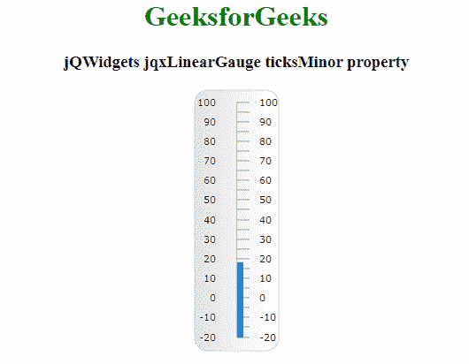

# jQWidgets jqxLinearGauge ticksMinor 属性

> 原文：[https://www.geeksforgeeks.org/jqwidgets-jqxgauge-lineargauge-ticksminor-property/](https://www.geeksforgeeks.org/jqwidgets-jqxgauge-lineargauge-ticksminor-property/)

**jQWidgets** 是一个 JavaScript 框架，用于为 PC 和移动设备制作基于 web 的应用程序。它是一个非常强大、优化、独立于平台并且得到广泛支持的框架。`jqxGauge` 代表一个 jQuery 量表小部件，它是一个数值范围内的指示器。我们可以使用仪表来显示数据区域中一系列值中的一个值，有两种类型的仪表：径向仪表和线性仪表。**线性仪表**是一个仪表部件，可以水平或垂直表示，它的值由一些值以垂直方式线性表示。

`ticksMinor` 属性用于设置或返回 `ticksMinor` 属性。即，该属性用于设置或返回 `jqxLinearGauge` 的次要刻度的属性。它接受 `Object` 类型值，默认值为 `{ size: '10%', interval: 5, style: { stroke: '#A1A1A1', 'stroke-width': 1 }, visible: true }`。

## 语法

它用于设置 `ticksMinor` 属性。

```javascript
$('Selector').jqxLinearGauge({ ticksMinor : Object});
```

它用于返回 `ticksMinor` 属性。

```javascript
var ticksMinor = $('Selector').jqxLinearGauge('ticksMinor');
```

## 可能值

*   `size`：指定刻度的长度。此属性接受像素或百分比大小。
*   `interval`：指定滴答的频率。当 `interval` 等于 5 时，仪表的每五分之一值将有一个小刻度。
*   `visible`：表示次要刻度是否可见。
*   `style`：用于设置勾的样式，它的颜色和厚度。

## 链接文件

从链接下载 [jQWidgets](https://www.jqwidgets.com/download/Download)。在 HTML 文件中，找到下载文件夹中的脚本文件。

```html
<link rel="stylesheet" href="jqwidgets/styles/jqx.base.css" type="text/css"/>
<script type="text/javascript" src="scripts/jquery-1.11.1.min.js"></script>
<script type="text/javascript" src="jqwidgets/jqxcore.js"></script>
<script type="text/javascript" src="jqwidgets/jqxchart.js"></script>
```

## 示例

下面的示例说明了 jQWidgets 中的 `jqxLinearGauge` `ticksMinor` 属性。

### HTML

```html
<!DOCTYPE html>
<html lang="en">
  <head>
    <link rel="stylesheet"
      href="jqwidgets/styles/jqx.base.css"
      type="text/css"/>
    <script type="text/javascript" 
            src="scripts/jquery-1.11.1.min.js">
    </script>
    <script type="text/javascript" 
            src="jqwidgets/jqxcore.js">
    </script>
    <script type="text/javascript" 
            src="jqwidgets/jqxchart.js">
    </script>
    <script type="text/javascript" 
      src="jqwidgets/jqxgauge.js">
    </script>
  </head>

<body>
    <center>
      <h1 style="color: green">GeeksforGeeks</h1>
      <h3>jQWidgets jqxLinearGauge ticksMinor property</h3>
      <div id="gauge"></div>
    </center>

<script type="text/javascript">
      $(document).ready(function () {
        $("#gauge").jqxLinearGauge({
          max: 100,
          min: -20,
          value: 18,
          ticksPosition: "far",
          ticksMinor: { size: "10%", interval: 5 },
        });
      });
    </script>
  </body>
</html>
```

## 输出



## 参考

[https://www.jqwidgets.com/jquery-widgets-documentation/documentation/jqxgauge/jquery-gauge-api.htm?search=](https://www.jqwidgets.com/jquery-widgets-documentation/documentation/jqxgauge/jquery-gauge-api.htm?search=)