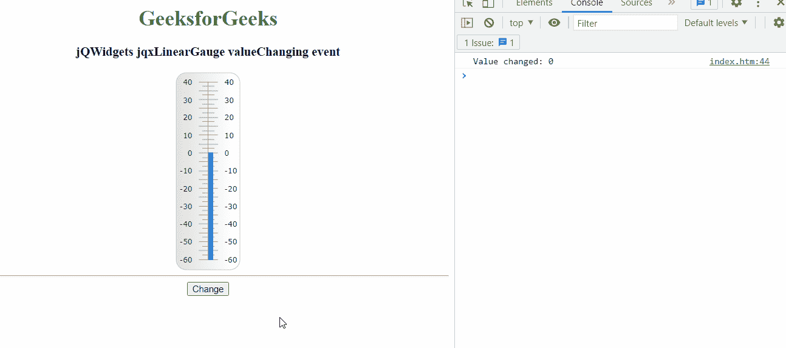

# jQWidgets jqxGauge 线规值更改事件

> 原文: [https://www.geeksforgeeks.org/jqwidgets-jqxgauge-lineargauge-valuechanging-event/](https://www.geeksforgeeks.org/jqwidgets-jqxgauge-lineargauge-valuechanging-event/)

**jQWidgets** 是一个 JavaScript 框架，用于为 PC 和移动设备制作基于 web 的应用程序。它是一个非常强大、优化、独立于平台且得到广泛支持的框架。`jqxGauge` 代表一个 jQuery 量表小部件，它是一个范围值内的指标。我们可以使用仪表来显示数据区域中某个值范围内的值，有两种类型的仪表:径向仪表和线性仪表。在 `LinearGauge` 中，值由一些值以垂直方式线性表示。

当仪表值改变时，触发 `valueChanging` 事件。

## 语法

```javascript
$('#jqxGauge').bind('valueChanging', function (e) {
    code here
});
```

## 链接文件

下载 [jQWidgets](https://www.jqwidgets.com/download/)。在 HTML 文件中，找到下载文件夹中的脚本文件。

```html
<link rel="stylesheet" href="jqwidgets/styles/jqx.base.css" type="text/css">
<script type="text/javascript" src="scripts/jquery-1.11.1.min.js"></script>
<script type="text/javascript" src="jqwidgets/jqxcore.js"></script>
<script type="text/javascript" src="jqwidgets/jqxchart.js"></script>
```

## 示例

下面的示例说明了 jQWidgets 中的 `jqxLinearGauge` `valueChanging` 事件。

### HTML

```html
<!DOCTYPE html>
<html lang="en">

<head>
  <link rel="stylesheet"
        href="jqwidgets/styles/jqx.base.css" 
        type="text/css" />
  <script type="text/javascript" 
          src="scripts/jquery-1.11.1.min.js">
  </script>
  <script type="text/javascript" 
          src="jqwidgets/jqxcore.js">
  </script>
  <script type="text/javascript" 
          src="jqwidgets/jqxchart.js">
  </script>
  <script type="text/javascript" 
          src="jqwidgets/jqxgauge.js">
  </script>
</head>

<body>
    <center>
        <h1 style="color:green;">
          GeeksforGeeks
        </h1>

<h3>jQWidgets jqxLinearGauge valueChanging event</h3>

<div id="gauge"></div>
        <hr>
        <button id='btn'>Change</button>
    </center>

<script type="text/javascript">
        $(document).ready(function () {
            $("#gauge").jqxLinearGauge({
                value: 0,
            });            
        });
        $("#btn").click(function () {
            $('#gauge').jqxLinearGauge({
                value: 30
            });
        });
        $('#gauge').bind('valueChanging', function (e) {
            console.log('Value changed: ' + e.args.value);
        });

</script>
</body>
</html>
```

## 输出



## 参考

[https://www.jqwidgets.com/jquery-widgets-documentation/documentation/jqxgauge/jquery-gauge-api.htm?search=](https://www.jqwidgets.com/jquery-widgets-documentation/documentation/jqxgauge/jquery-gauge-api.htm?search=)