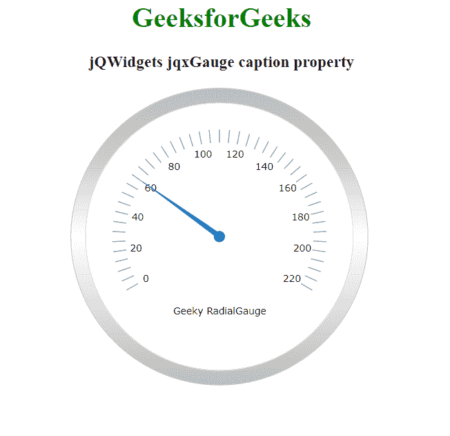

# jQWidgets jqxGauge RadialGauge 字幕属性

> 原文: [https://www.geeksforgeeks.org/jqwidgets-jqxgauge-radialgauge-caption-property/](https://www.geeksforgeeks.org/jqwidgets-jqxgauge-radialgauge-caption-property/)

**jQWidgets** 是一个 JavaScript 框架，用于为 PC 和移动设备制作基于 web 的应用程序。它是一个非常强大、优化、独立于平台且得到广泛支持的框架。`jqxGauge` 代表一个 jQuery gauge 小部件，它是一个值范围内的指示器。我们可以使用仪表来显示数据区域中一系列值中的一个值，有两种类型的仪表:径向仪表和线性仪表。在**径向仪表**中，数值由一些数值以圆形方式径向表示。

`caption` 属性用于设置或返回标题属性，即用于设置 `jqxGauge` 元素的标题。它接受一个对象，默认值为 `{value:"", position:'bottom', offset:[0,0], visible:true}`。

## 语法

设置 `caption` 属性。

```javascript
$('Selector').jqxGauge({ caption: object });
```

返回 `caption` 属性。

```javascript
var caption = $('Selector').jqxGauge('caption');
```

## 链接文件

从链接下载 [jQWidgets](https://www.jqwidgets.com/download/)。在 HTML 文件中，找到下载文件夹中的脚本文件。

```html
<link rel="stylesheet" href="jqwidgets/styles/jqx.base.css" type="text/css">
<script type="text/javascript" src="scripts/jquery-1.11.1.min.js"></script>
<script type="text/javascript" src="jqwidgets/jqxcore.js"></script>
<script type="text/javascript" src="jqwidgets/jqxchart.js"></script>
```

## 示例

以下示例说明了 jQWidgets 中的 `jqxGauge` `caption` 属性。

### HTML

```html
<!DOCTYPE html>
<html lang="en">
   <head>
      <link rel="stylesheet" href=
         "jqwidgets/styles/jqx.base.css" type="text/css" />
      <script type="text/javascript" 
         src="scripts/jquery-1.11.1.min.js"></script>
      <script type="text/javascript" 
         src="jqwidgets/jqxcore.js"></script>
      <script type="text/javascript" 
         src="jqwidgets/jqxchart.js"></script>
      <script type="text/javascript" 
         src="jqwidgets/jqxgauge.js"></script>
   </head>
   <body>
      <center>
         <h1 style="color: green;">
            GeeksforGeeks
         </h1>
         <h3>jQWidgets jqxGauge caption property</h3>
         <div id="gauge"></div>
      </center>
      <script type="text/javascript">
         $(document).ready(function () {
             $("#gauge").jqxGauge({   
                 caption: {value:"Geeky RadialGauge"},
                 value: 60,
             });
         });
      </script>
   </body>
</html>
```

## 输出



## 参考

[https://www.jqwidgets.com/jquery-widgets-documentation/documentation/jqxgauge/jquery-gauge-api.htm?search=](https://www.jqwidgets.com/jquery-widgets-documentation/documentation/jqxgauge/jquery-gauge-api.htm?search=)