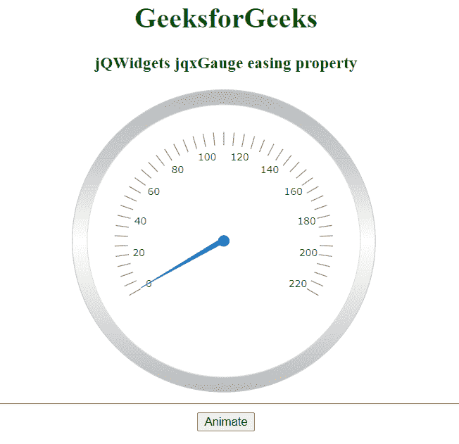

# jQWidgets jqxGauge RadialGauge 缓动属性

> 原文: [https://www.geeksforgeeks.org/jqwidgets-jqxgauge-radialgauge-easing-property/](https://www.geeksforgeeks.org/jqwidgets-jqxgauge-radialgauge-easing-property/)

`jQWidgets` 是一个 JavaScript 框架，用于为 PC 和移动设备制作基于 web 的应用程序。它是一个非常强大和优化的框架，独立于平台，并得到广泛支持。`jqxGauge` 代表一个 jQuery gauge 小部件，它是一个值范围内的指示器。我们可以使用仪表来显示数据区域中一系列值中的一个值，有两种类型的仪表:径向仪表和线性仪表。在**径向仪表**中，数值由一些数值以圆形方式径向表示。

`easing` 属性用于设置或返回缓动属性，即用于设置 `jqxGauge` 元素的缓动动画。它接受字符串值，默认值是 `linear`。

## 语法

设置缓动属性。

```javascript
$('Selector').jqxGauge({ easing: string});
```

获取缓动属性。

```javascript
var easing = $('Selector').jqxGauge('easing');
```

## 链接文件

从 [https://www.jqwidgets.com/download/](https://www.jqwidgets.com/download/) 链接下载 `jQWidgets`。在 HTML 文件中，找到下载文件夹中的脚本文件:

```html
<link rel="stylesheet" href="jqwidgets/styles/jqx.base.css" type="text/css" />
<script type="text/javascript" src="scripts/jquery-1.11.1.min.js"></script>
<script type="text/javascript" src="jqwidgets/jqxcore.js"></script>
<script type="text/javascript" src="jqwidgets/jqxchart.js"></script>
```

下面的例子说明了 `jQWidgets` 中的 `jqxGauge` 动画缓动属性:

## 示例

在本例中，我们使用了 `easeOutBack` 值。

### HTML

```html
<!DOCTYPE html>
<html lang="en">

<head>
  <link rel="stylesheet" href=
         "jqwidgets/styles/jqx.base.css" type="text/css" />
  <script type="text/javascript"
          src="scripts/jquery-1.11.1.min.js"></script>
  <script type="text/javascript"
          src="jqwidgets/jqxcore.js"></script>
  <script type="text/javascript"
          src="jqwidgets/jqxchart.js"></script>
  <script type="text/javascript"
          src="jqwidgets/jqxgauge.js"></script>
</head>

<body>
    <center>
        <h1 style="color: green;">
          GeeksforGeeks
          </h1>

<h3>jQWidgets jqxGauge easing property</h3>
        <div id="gauge"></div>
        <hr>
      <button id = 'btn'>Animate</button>
    </center>

<script type="text/javascript">
        $(document).ready(function () {
            $("#gauge").jqxGauge({
                animationDuration: 1200,
                easing: 'easeOutBack'
            });

$("#btn").click(function () {
                $('#gauge').jqxGauge({
                    value: 150
                });
            });
        });
    </script>
</body>
</html>
```

### 输出



## 参考

[https://www.jqwidgets.com/jquery-widgets-documentation/documentation/jqxgauge/jquery-gauge-api.htm?search=](https://www.jqwidgets.com/jquery-widgets-documentation/documentation/jqxgauge/jquery-gauge-api.htm?search=)