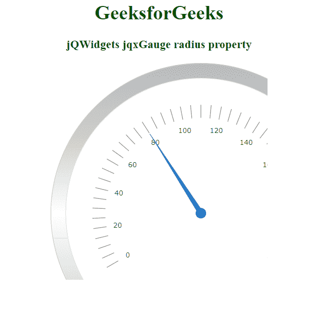

# jQWidgets jqxGauge 半径属性

> 原文: [https://www.geeksforgeeks.org/jqwidgets-jqxgauge-radialgauge-radius-property/](https://www.geeksforgeeks.org/jqwidgets-jqxgauge-radialgauge-radius-property/)

## 介绍

**jQWidgets** 是一个 JavaScript 框架，用于为 PC 和移动设备制作基于 web 的应用程序。它是一个非常强大和优化的框架，独立于平台，并得到广泛支持。`jqxGauge` 代表一个 jQuery gauge 小部件，它是一个值范围内的指示器。我们可以使用仪表来显示数据区域中一系列值中的一个值，有两种类型的仪表:径向仪表和线性仪表。在径向仪表中，数值由一些数值以圆形方式径向表示。

`radius` 属性用于设置或返回半径属性，即用于设置 `jqxGauge` 元素的半径，它接受一个数值，默认值为 `"70%"`。

## 语法

*   设置 `radius` 属性。

```javascript
$('Selector').jqxGauge({ radius: number });
```

*   返回 `radius` 属性。

```javascript
var radius = $('Selector').jqxGauge('radius');
```

## 链接文件

从 [https://www.jqwidgets.com/download/](https://www.jqwidgets.com/download/) 链接下载 jQWidgets。在 HTML 文件中，找到下载文件夹中的脚本文件:

```html
<link rel="stylesheet" href="jqwidgets/styles/jqx.base.css" type="text/css">
<script type="text/javascript" src="scripts/jquery-1.11.1.min.js"></script>
<script type="text/javascript" src="jqwidgets/jqxcore.js"></script>
<script type="text/javascript" src="jqwidgets/jqxchart.js"></script>
```

以下示例说明了 jQWidgets 中的 `jqxGauge` `radius` 属性:

## 示例

在本示例中，仪表的半径值设置为 70%。

```html
<!DOCTYPE html>
<html lang="en">

<head>
  <link rel="stylesheet"
        href="jqwidgets/styles/jqx.base.css"
        type="text/css" />
  <script type="text/javascript"
          src="scripts/jquery-1.11.1.min.js">
  </script>
  <script type="text/javascript"
          src="jqwidgets/jqxcore.js">
  </script>
  <script type="text/javascript"
          src="jqwidgets/jqxchart.js">
  </script>
  <script type="text/javascript"
          src="jqwidgets/jqxgauge.js">
  </script>
</head>

<body>
    <center>
        <h1 style="color: green;">
          GeeksforGeeks
        </h1>

<h3>jQWidgets jqxGauge radius property</h3>

<div id="gauge"></div>
    </center>

<script type="text/javascript">
        $(document).ready(function () {
            $("#gauge").jqxGauge({
                value: 80,
                radius: '70%'
            });
        });
    </script>
</body>

</html>
```

## 输出



## 参考

[https://www.jqwidgets.com/jquery-widgets-documentation/documentation/jqxgauge/jquery-gauge-api.htm?search=](https://www.jqwidgets.com/jquery-widgets-documentation/documentation/jqxgauge/jquery-gauge-api.htm?search=)