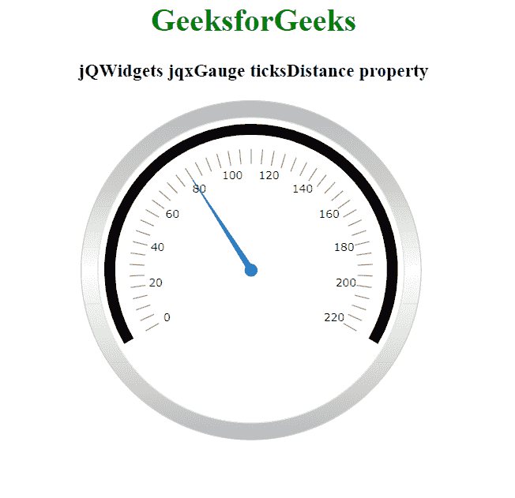

# jQWidgets jqxGauge RadialGauge ticksDistance Property

> 原文: [https://www.geeksforgeeks.org/jqwidgets-jqxgauge-radialgauge-ticksdistance-property/](https://www.geeksforgeeks.org/jqwidgets-jqxgauge-radialgauge-ticksdistance-property/)

`jQWidgets` 是一个 JavaScript 框架，用于为 PC 和移动设备制作基于 web 的应用程序。它是一个非常强大和优化的框架，独立于平台，并得到广泛支持。`jqxGauge` 代表一个 jQuery 量表小部件，它是一个范围值内的指标。我们可以使用仪表来显示数据区域中一系列值中的一个值，有两种类型的仪表:径向仪表和线性仪表。在径向仪表中，数值由一些数值以圆形方式径向表示。

`ticksDistance` 属性用于设置或返回 `ticksDistance` 属性，即用于设置或获取 `jqxGauge` 元素的刻度位置。它接受一个数值，默认值为 20。

## 语法

*   设置 `ticksDistance` 属性。

```javascript
$('Selector').jqxGauge({ ticksDistance : 20 });
```

*   返回 `ticksDistance` 属性。

```javascript
var ticksDistance = $('Selector').jqxGauge('ticksDistance');
```

## 链接文件

从链接下载 [jQWidgets](https://www.jqwidgets.com/download/)。在 HTML 文件中，找到下载文件夹中的脚本文件:

```html
<link rel="stylesheet" href="jqwidgets/styles/jqx.base.css" type="text/css">
<script type="text/javascript" src="scripts/jquery-1.11.1.min.js"></script>
<script type="text/javascript" src="jqwidgets/jqxcore.js"></script>
<script type="text/javascript" src="jqwidgets/jqxchart.js"></script>
```

下面的例子说明了 `jQWidgets` 中的 `jqxGauge` `ticksDistance` 属性:

## 示例

### HTML

```html
<!DOCTYPE html>
<html lang="en">

<head>
    <link rel="stylesheet"
          href="jqwidgets/styles/jqx.base.css"
          type="text/css" />
    <script type="text/javascript"
            src="scripts/jquery-1.11.1.min.js">
    </script>
    <script type="text/javascript"
            src="jqwidgets/jqxcore.js">
    </script>
    <script type="text/javascript"
            src="jqwidgets/jqxchart.js">
    </script>
    <script type="text/javascript"
            src="jqwidgets/jqxgauge.js">
    </script>
</head>

<body>
    <center>
        <h1 style="color: green;">
            GeeksforGeeks
        </h1>

        <h3>jQWidgets jqxGauge ticksDistance property</h3>

        <div id="gauge"></div>
    </center>
    <script type="text/javascript">
        $(document).ready(function () {
            $("#gauge").jqxGauge({
                ranges: [{
                    startValue: 0,
                    endValue: 220 },
                ],
                value: 80,
            });
            $('#gauge').jqxGauge({ ticksDistance: 32 });
        });
    </script>
</body>

</html>
```

## 输出



## 参考

[https://www.jqwidgets.com/jquery-widgets-documentation/documentation/jqxgauge/jquery-gauge-api.htm](https://www.jqwidgets.com/jquery-widgets-documentation/documentation/jqxgauge/jquery-gauge-api.htm)