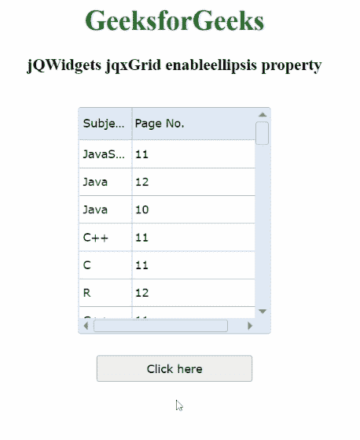

# jQWidgets jqxGrid enableellipsis 属性

> 原文: [https://www.geeksforgeeks.org/jqwidgets-jqxgrid-enableellipsis-property/](https://www.geeksforgeeks.org/jqwidgets-jqxgrid-enableellipsis-property/)

**jQWidgets** 是一个 JavaScript 框架，用于为 PC 和移动设备制作基于 web 的应用程序。它是一个非常强大、优化、独立于平台并且得到广泛支持的框架。`jqxGrid` 用于说明以表格形式显示数据的 jQuery 小部件。此外，它完全支持与数据的连接，以及分页、分组、排序、过滤和编辑。

`enableellipsis` 属性用于分析单元格或列内容溢出时省略号是否显示。它属于布尔类型，其缺省值为真。

## 语法

设置 `enableellipsis` 属性。

```javascript
$('#Selector').jqxGrid({ enableellipsis: false});
```

返回 `enableellipsis` 属性。

```javascript
var enableellipsis = $('#Selector').jqxGrid('enableellipsis');
```

## 链接文件

从给定链接下载 [https://www.jqwidgets.com/download/](https://www.jqwidgets.com/download/)。在 HTML 文件中，找到下载文件夹中的脚本文件。

```html
<link rel="stylesheet" href="jqwidgets/styles/jqx.base.css" type="text/css">
<script type="text/javascript" src="scripts/jquery-1.11.1.min.js"></script>
<script type="text/javascript" src="jqwidgets/jqxcore.js"></script>
<script type="text/javascript" src="jqwidgets/jqxdata.js"></script>
```

下面的示例说明了 jQWidgets 中的 `jqxGrid` `enableellipsis` 属性。

## 示例

### HTML

```html
<!DOCTYPE html>
<html lang="en">

<head>
    <link rel="stylesheet"
          href="jqwidgets/styles/jqx.base.css" 
          type="text/css" />
    <script type="text/javascript" 
            src="scripts/jquery-1.11.1.min.js">
    </script>
    <script type="text/javascript" 
            src="jqwidgets/jqxcore.js">
    </script>
    <script type="text/javascript" 
            src="jqwidgets/jqxdata.js">
    </script>
    <script type="text/javascript" 
            src="jqwidgets/jqxbuttons.js">
    </script>
    <script type="text/javascript" 
            src="jqwidgets/jqxscrollbar.js">
    </script>
    <script type="text/javascript" 
            src="jqwidgets/jqxmenu.js">
    </script>
    <script type="text/javascript" 
            src="jqwidgets/jqxgrid.js">
    </script>
    <script type="text/javascript" 
            src="jqwidgets/jqxgrid.selection.js">
    </script>
    <script type="text/javascript" 
            src="jqwidgets/jqxgrid.columnsresize.js">
    </script>
</head>

<body>
    <center>
        <h1 style="color: green">
            GeeksforGeeks
        </h1>
        <h3>jQWidgets jqxGrid enableellipsis property</h3>
        <br />
        <div id="jqxg"></div>
        <div>
            <input type="button" id="jqxBtn" 
                style="margin-top: 25px" value="Click here" />
        </div>
        <div id="log"></div>
    </center>

    <script type="text/javascript">
        $(document).ready(function () {
            var d = new Array();
            var subjectNames =
                ["C++", "Scala", "Java", "C", "R", "JavaScript"];
            var pageNumber =
                ["7", "8", "12", "11", "10", "19"];
            for (var j = 0; j < 50; j++) {
                var r = {};
                r["subjectnames"] =
                    subjectNames[Math.floor(
                        Math.random() * subjectNames.length)
                    ];
                r["pagenumber"] =
                    pageNumber[Math.floor(
                        Math.random() * pageNumber.length)
                    ];
                d[j] = r;
            }
            var src = {
                localdata: d,
                datatype: "array",
            };
            var data_Adapter = new $.jqx.dataAdapter(src);
            $("#jqxg").jqxGrid({
                source: data_Adapter,
                theme: 'energyblue',
                enableellipsis: true,
                height: "260px",
                width: "220px",
                columns: [
                    {
                        text: "Subject Name",
                        datafield: "subjectnames",
                        width: "60px",
                    },
                    {
                        text: "Page No.",
                        datafield: "pagenumber",
                        width: "160px",
                    },
                ],
            });
            $("#jqxBtn").jqxButton({
                width: "180px",
                height: "30px",
            });
            $("#jqxBtn").on("click", function () {
                var ee = $('#jqxg').jqxGrid('enableellipsis');
                $('#log').text("Ellipsis enabled: " + ee);
            });
        });
    </script>
</body>

</html>
```

## 输出



## 参考

[https://www.jqwidgets.com/jquery-widgets-documentation/documentation/jqxgrid/jquery-grid-api.htm?search=](https://www.jqwidgets.com/jquery-widgets-documentation/documentation/jqxgrid/jquery-grid-api.htm?search=)