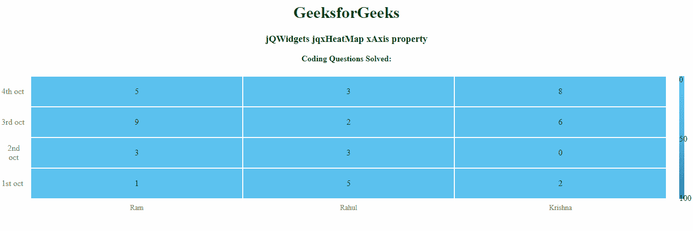

# jQWidgets jqxHeatMap xAxis 性质

> 哎哎哎:# t0]https://www . geeksforgeeks . org/jqwidgets-jqxheatmap-xaxis-property/

`jQWidgets` 是一个 JavaScript 框架，用于为 PC 和移动设备制作基于 web 的应用程序。它是一个非常强大和优化的框架，独立于平台，并得到广泛支持。`jqxHeatMap` 代表一个 jQuery 小部件，它显示了使用颜色编码来表示不同值的数据的图形表示。

`xAxis` 属性用于设置或返回 `xAxis` 属性。即该属性用于设置或返回热图 x 轴设置。它接受对象类型值，默认值为 `null`。

## 语法

*   它用于设置 `xAxis` 属性。

```html
$('Selector').jqxHeatMap({ xAxis : array});
```

*   它用于返回 `xAxis` 属性。

```html
var xAxis = $('Selector').jqxHeatMap('xAxis');
```

## 属性

*   `labels`: 用于设置不使用 `min` 和 `max` 属性时的 x 轴标签。
*   `position`: 用于设置轴是否相对于默认位置显示在相对侧。默认值为 `false`。
*   `isInverted`: 用于设置轴是否显示在反转位置。默认值为 `false`。
*   `min`: 用于设置 x 轴的最小范围。
*   `max`: 用于设置 x 轴的最大范围。
*   `labelFormat`: 用于设置 `min` 和 `max` 的属性时，格式化轴的标签。可能的标签格式选项有 `short`、`numeric`、`2-digit`、`narrow`、`short` 或 `long`，其中 `short` 是默认值。

## 链接文件

从链接下载 [jQWidgets](https://www.jqwidgets.com/download/)。在 HTML 文件中，找到下载文件夹中的脚本文件。

```html
<script type="text/javascript" src="scripts/jquery-1.11.1.min.js"></script>
<script type="text/javascript" src="jqwidgets/jqxcore.js"></script>
```

## 示例

下面的示例说明了 `jQWidgets` 中的 `jqxHeatMap` `xAxis` 属性。

### 超文本标记语言

```html
<!DOCTYPE html>
<html lang="en">

<head>
    <link rel="stylesheet" 
          href="jqwidgets/styles/jqx.base.css" 
          type="text/css" />
    <script type="text/javascript" 
            src="scripts/jquery-1.11.1.min.js">
    </script>
    <script type="text/javascript" 
            src="jqwidgets/jqxcore.js">
    </script>
    <script type="text/javascript" 
            src="jqwidgets/jqxheatmap.js">
    </script>
</head>

<body>
    <center>
        <h1 style="color: green">
          GeeksforGeeks
        </h1>
        <h3>jQWidgets jqxHeatMap xAxis property</h3>
        <body class='default'>
            <div id="heatmap"></div>
        </body>
    </center>
    <script type="text/javascript">
        $(document).ready(function () {
            var x = {
                labels: ['Ram', 'Rahul', 'Krishna']
            };
            var y = {
                labels: ['1st oct', '2nd oct', 
                '3rd oct', '4th oct']
            };
            var arr = [
                [1, 3, 9, 5],
                [5, 3, 2, 3],
                [2, 0, 6, 8]
            ];
            $("#heatmap").jqxHeatMap({
                xAxis: x,
                yAxis: y,
                source: arr,
                title: 'Coding Questions Solved:',
            });
        });
    </script>
</body>

</html>
```

## 输出



## 参考

[https://www.jqwidgets.com/jquery-widgets-documentation/documentation/jqxheatmap/jquery-heatmap-api.htm?search=](https://www.jqwidgets.com/jquery-widgets-documentation/documentation/jqxheatmap/jquery-heatmap-api.htm?search=)