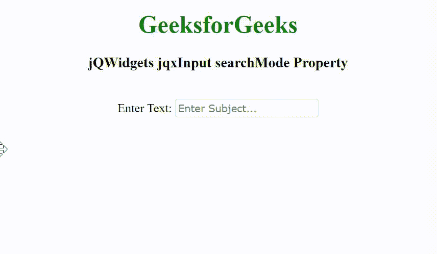

# jQWidgets jqxInput searchMode 属性

> 原文：[https://www.geeksforgeeks.org/jqwidgets-jqxinput-searchmode-property/](https://www.geeksforgeeks.org/jqwidgets-jqxinput-searchmode-property/)

jQWidgets 是一个 JavaScript 框架，用于为 PC 和移动设备制作基于 web 的应用程序。它是一个非常强大、优化、独立于平台并且得到广泛支持的框架。`jqxInput` 用于表示包含自动完成功能的 jQuery 输入小部件。

`searchMode` 属性用于设置或返回搜索模式。当用户键入输入文本并尝试使用输入的文本和选定的搜索模式查找搜索到的项目时，将使用此属性。它接受字符串类型值，其默认值为 `"default"`。

`searchMode` 属性的可能值如下：
- `"none"`
- `"contains"`
- `"containsignorecase"`
- `"equals"`
- `"equalsignorecase"`
- `"startswithignorecase"`
- `"startswith"`
- `"endswithignorecase"`
- `"endswith"`

**语法**

设置 `searchMode` 属性：
```javascript
$('selector').jqxInput({ searchMode: String });
```

返回 `searchMode` 属性：
```javascript
var searchMode = $('selector').jqxInput('searchMode');
```

**链接文件**

从链接 [https://www.jqwidgets.com/download/](https://www.jqwidgets.com/download/) 下载 jQWidgets。在 HTML 文件中，找到下载文件夹中的脚本文件。
```html
<link rel="stylesheet" href="jqwidgets/styles/jqx.base.css" type="text/css" />
<script type="text/javascript" src="scripts/jquery-1.11.1.min.js"></script>
<script type="text/javascript" src="jqwidgets/jqx-all.js"></script>
<script type="text/javascript" src="jqwidgets/jqxcore.js"></script>
```

下面的例子说明了 jQWidgets 中的 `jqxInput` `searchMode` 属性。

## 示例

### 示例代码

```html
<!DOCTYPE html>
<html lang="en">

<head>
    <link rel="stylesheet" href=
        "jqwidgets/styles/jqx.base.css" type="text/css" />
    <script type="text/javascript" 
        src="scripts/jquery-1.11.1.min.js">
    </script>
    <script type="text/javascript" 
        src="jqwidgets/jqx-all.js">
    </script>
    <script type="text/javascript" 
        src="jqwidgets/jqxcore.js">
    </script>
    <script type="text/javascript" 
        src="jqwidgets/jqxinput.js">
    </script>
</head>

<body class='default'>
    <center>
        <h1 style="color: green;">
            GeeksforGeeks
        </h1>
        <h3>
            jQWidgets jqxInput searchMode Property
        </h3>
        <br>
        <label for="css">Enter Text: </label>
        <input type="text" id="GFG" />
    </center>

    <script type="text/javascript">
        $(document).ready(function() {
            var data = [
                "Computer Science",
                "C Programming",
                "C++ Programming",
                "Java Programming",
                "Python Programming",
                "HTML",
                "CSS",
                "JavaScript",
                "jQuery",
                "PHP",
                "Bootstrap"
            ];

            $("#GFG").jqxInput({
                source: data,
                placeHolder: "Enter Subject...",
                searchMode: 'startswith'
            });
        });
    </script>
</body>

</html>
```

**输出**



**参考**

[https://www.jqwidgets.com/jquery-widgets-documentation/documentation/jqxinput/jquery-input-api.htm](https://www.jqwidgets.com/jquery-widgets-documentation/documentation/jqxinput/jquery-input-api.htm)