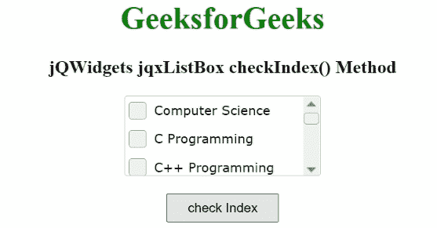

# jqwidgets jqxlistbox checkIndex()方法

> 原文: [https://www.geeksforgeeks.org/jqwidgets-jqxlistbox-checkindex-method/](https://www.geeksforgeeks.org/jqwidgets-jqxlistbox-checkindex-method/)

`jQWidgets` 是一个 JavaScript 框架，用于为 PC 和移动设备制作基于 web 的应用程序。它是一个非常强大、优化、独立于平台并且得到广泛支持的框架。`jqxListBox` 用于说明一个 jQuery ListBox 小部件，它包含一个可选择元素的列表。

当 `checkboxes` 属性值设置为真时，`checkIndex()` 方法用于检查指定列表中的项目。此外，索引基于零，换句话说，为了检查初始项目，必须与参数零一起调用 `checkIndex` 方法。它不返回任何东西。

**语法:**

```javascript
$("#jqxListBox").jqxListBox('checkIndex', index);
```

**参数:**

*   `index`: 所述类型号的索引。索引从 0 开始。

**链接文件:** 从链接下载 [jQWidgets](https://www.jqwidgets.com/download/) 。在 HTML 文件中，找到下载文件夹中的脚本文件。

```html
<link rel="stylesheet" href="jqwidgets/styles/jqx.base.css" type="text/css" />
<script type="text/javascript" src="scripts/jquery-1.11.1.min.js"></script>
<script type="text/javascript" src="jqwidgets/jqx-all.js"></script>
```

**示例:** 下面的示例说明了 `jQWidgets` 中的 `jqxListBox` `checkIndex()` 方法。

## HTML

```html
<!DOCTYPE html>
<html lang="en">
    <head>
        <link rel="stylesheet" href=
            "jqwidgets/styles/jqx.base.css" type="text/css" />
        <script type="text/javascript" 
            src="scripts/jquery-1.11.1.min.js"></script>
        <script type="text/javascript" 
            src="jqwidgets/jqx-all.js"></script>
        <script type="text/javascript" 
            src="jqwidgets/jqxcore.js"></script>
        <script type="text/javascript" 
            src=".jqwidgets/jqxbuttons.js"></script>
        <script type="text/javascript" 
            src="jqwidgets/jqxscrollbar.js"></script>
        <script type="text/javascript" 
            src="jqwidgets/jqxlistbox.js"></script>
    </head>

<body>
        <center>
            <h1 style="color: green;">
                GeeksforGeeks
            </h1>

<h3>
                jQWidgets jqxListBox checkIndex() Method
            </h3>

<div id="jqxLB"></div>
            <br />
            <input type="button" id="jqxBtn" 
                style="padding: 5px 20px;" 
                value="check Index" />
        </center>

<script type="text/javascript">
            $(document).ready(function () {
                var data = [
                  "Computer Science", 
                  "C Programming",
                  "C++ Programming",
                  "Java Programming",
                  "Python Programming", 
                  "HTML", 
                  "CSS", 
                  "JavaScript", 
                  "jQuery",
                  "PHP", 
                  "Bootstrap"];

$("#jqxLB").jqxListBox({
                    source: data,
                    width: "200px",
                    height: "80px",
                    checkboxes:true
                });

$("#jqxBtn").on("click", function () {
                    $("#jqxLB").jqxListBox("checkIndex", 1);
                });
            });
        </script>
    </body>
</html>
```

**输出:**



`checkIndex()`方法

**参考:** [https://www.jqwidgets.com/jquery-widgets-documentation/documentation/jqxlistbox/jquery-listbox-api.htm?search=](https://www.jqwidgets.com/jquery-widgets-documentation/documentation/jqxlistbox/jquery-listbox-api.htm?search=)