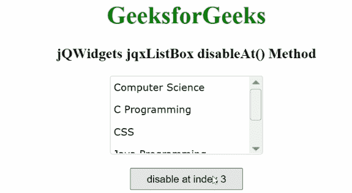

# jqwidgets jqxlistox disableAt()方法

> 原文：[https://www.geeksforgeeks.org/jqwidgets-jqxlistbox-disableat-method/](https://www.geeksforgeeks.org/jqwidgets-jqxlistbox-disableat-method/)

`jQWidgets` 是一个 JavaScript 框架，用于为 PC 和移动设备制作基于 web 的应用程序。它是一个非常强大、优化、独立于平台并且得到广泛支持的框架。`jqxListBox` 用于说明一个 jQuery ListBox 小部件，它包含一系列可选元素。

`disableAt()`方法用于通过给定的索引禁用所述列表中的一个项目。这个方法不返回任何东西。

## 语法

```html
$("#jqxListBox").jqxListBox('disableAt', index);
```

## 参数

*   `index`：是所述类型号的索引。

## 链接文件

从链接下载 [jQWidgets](https://www.jqwidgets.com/download/)。在 HTML 文件中，找到下载文件夹中的脚本文件。

```html
<link rel="stylesheet" href="jqwidgets/styles/jqx.base.css" type="text/css">
<script type="text/javascript" src="scripts/jquery-1.11.1.min.js"></script>
<script type="text/javascript" src="jqwidgets/jqx-all.js"></script>
<script type="text/javascript" src="jqwidgets/jqxcore.js"></script>
```

## 示例

下面的示例说明了 `jQWidgets` 中的 `jqxListBox` `disableAt()`方法。

### HTML

```html
<html>
    <head>
        <link rel="stylesheet" 
              href="jqwidgets/styles/jqx.base.css" 
              type="text/css" />
        <script type="text/javascript"
                src="scripts/jquery-1.11.1.min.js">
        </script>
        <script type="text/javascript" 
                src="jqwidgets/jqx-all.js">
        </script>
        <script type="text/javascript" 
                src="jqwidgets/jqxcore.js">
        </script>
        <script type="text/javascript" 
                src=".jqwidgets/jqxbuttons.js">
        </script>
        <script type="text/javascript" 
                src="jqwidgets/jqxscrollbar.js">
        </script>
        <script type="text/javascript" 
                src="jqwidgets/jqxlistbox.js">
        </script>
    </head>
    <body>
        <center>
            <h1 style="color: green;">
                GeeksforGeeks
            </h1>
            <h3>
                jQWidgets jqxListBox disableAt() Method
            </h3>
            <div id="jqxLB"></div>
            <br />
            <input type="button" id="jqxBtn" 
                   style="padding: 5px 20px;"
                   value="disable at index 3" />
        </center>
        <script type="text/javascript">
            $(document).ready(function () {
                var data = [
                  "Computer Science", 
                  "C Programming",
                  "CSS",
                  "Java Programming",
                  "Python Programming"];

                $("#jqxLB").jqxListBox({
                    source: data,
                    width: "200px",
                    height: "100px",
                });

                $("#jqxBtn").on("click", function () {
                    $("#jqxLB").jqxListBox('disableAt', 3);
                });
            });
        </script>
    </body>
</html>
```

## 输出



## 参考

[https://www.jqwidgets.com/jquery-widgets-documentation/documentation/jqxlistbox/jquery-listbox-api.htm](https://www.jqwidgets.com/jquery-widgets-documentation/documentation/jqxlistbox/jquery-listbox-api.htm)