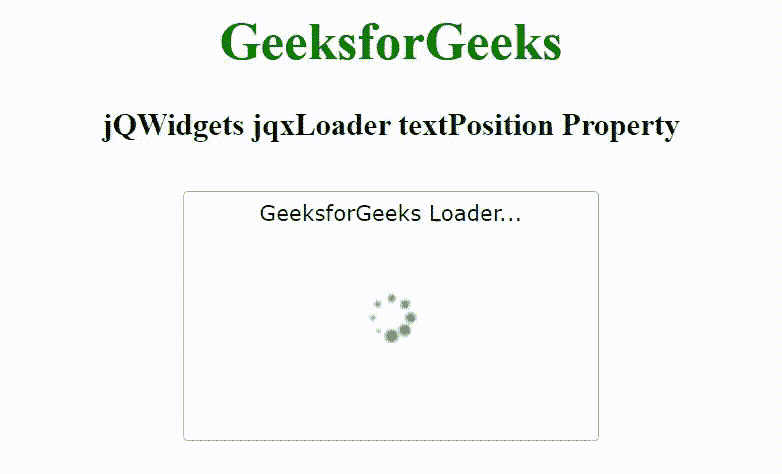

# jQWidgets jqxLoader textPosition 属性

> 原文: [https://www.geeksforgeeks.org/jqwidgets-jqxloader-textposition-property/](https://www.geeksforgeeks.org/jqwidgets-jqxloader-textposition-property/)

jQWidgets 是一个 JavaScript 框架，用于为 PC 和移动设备制作基于 web 的应用程序。它是一个非常强大、优化、独立于平台并且得到广泛支持的框架。`jqxLoader` 代表一个显示内置加载器元素的 jQuery 小部件。加载程序可以包含图标或文本或图标和文本的组合。加载器元素可以被加载，直到小部件的数据被加载。

## textPosition 属性

`textPosition` 属性用于设置或返回文本内容的对齐方式。它接受字符串类型值，默认值为“bottom”。

### 语法

设置 `textPosition` 属性。

```javascript
$('selector').jqxLoader({ textPosition: String });
```

返回 `textPosition` 属性。

```javascript
var textPosition = $('selector').jqxLoader('textPosition');
```

### 链接文件

从给定的链接 [https://www.jqwidgets.com/download/](https://www.jqwidgets.com/download/) 下载 jQWidgets。在 HTML 文件中，找到下载文件夹中的脚本文件。

```html
<link rel="stylesheet" href="jqwidgets/styles/jqx.base.css" type="text/css">
<link rel="stylesheet" href="jqwidgets/styles/jqx.energyblue.css" type="text/css">
<script type="text/javascript" src="scripts/jquery-1.11.1.min.js"></script>
<script type="text/javascript" src="jqwidgets/jqxcore.js"></script>
```

下面的例子说明了 jQWidgets `jqxLoader` 的 `textPosition` 属性。

## 示例

### HTML

```html
<!DOCTYPE html>
<html lang="en">

<head>
    <link rel="stylesheet" href=
        "jqwidgets/styles/jqx.base.css" type="text/css" />
    <link rel="stylesheet" href=
        "jqwidgets/styles/jqx.energyblue.css" type="text/css" />
    <script type="text/javascript" 
        src="scripts/jquery-1.11.1.min.js"></script>
    <script type="text/javascript" 
        src="jqwidgets/jqxcore.js"></script>
    <script type="text/javascript" 
        src="jqwidgets/jqxloader.js"></script>
</head>

<body>
    <center>
        <h1 style="color: green;">
            GeeksforGeeks
        </h1>
        <h3>
            jQWidgets jqxLoader textPosition Property
        </h3>
        <div style="margin-top: 130px;" 
            id="jqxLoader">
        </div>
    </center>

    <script type="text/javascript">
        $(document).ready(function() {
            $("#jqxLoader").jqxLoader({
                width: 250,
                height: 150,
                autoOpen: true,
                textPosition: 'top',
                text: "GeeksforGeeks Loader..."
            });
        });
    </script>
</body>

</html>
```

### 输出



### 参考

[https://www.jqwidgets.com/jquery-widgets-documentation/documentation/jqxloader/jquery-loader-api.htm](https://www.jqwidgets.com/jquery-widgets-documentation/documentation/jqxloader/jquery-loader-api.htm)