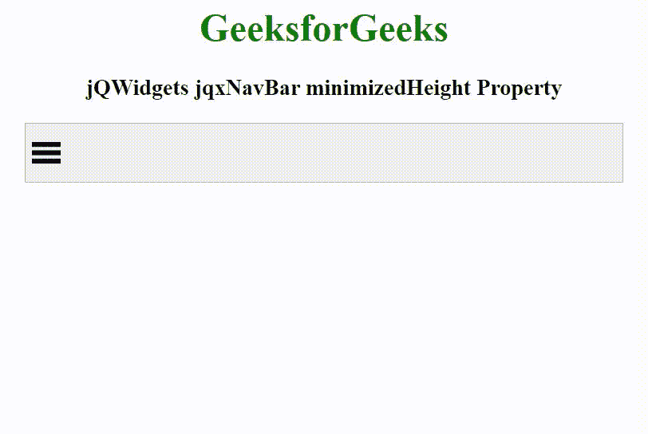

# jQWidgets jqxNavBar minimizedHeight 属性

> 原文参考：[https://www.geeksforgeeks.org/jqwidgets-jqxnavbar-minimize](https://www.geeksforgeeks.org/jqwidgets-jqxnavbar-minimize)

jQWidgets 是一个 JavaScript 框架，用于为 PC 和移动设备制作基于 web 的应用程序。它是一个非常强大、优化、独立于平台并且得到广泛支持的框架。`jqxNavBar` 表示由 JQuery 构建的导航栏小部件。此小部件用于创建简单或响应式的水平/垂直导航菜单布局。

`minimizedHeight` 属性用于设置或返回最小化状态的高度。它接受数字类型值，默认值为 30。

## 语法

设置 `minimizedHeight` 属性。

```javascript
$('selector').jqxNavBar({ minimizedHeight: Number });
```

返回 `minimizedHeight` 属性。

```javascript
var minimizedHeight = $('selector').jqxNavBar('minimizedHeight');
```

## 链接文件

从给定的链接 [https://www.jqwidgets.com/download/](https://www.jqwidgets.com/download/) 下载 jQWidgets。在 HTML 文件中，找到下载文件夹中的脚本文件。

```html
<link rel="stylesheet" href="jqwidgets/styles/jqx.base.css" type="text/css" />
<script type="text/javascript" src="scripts/jquery-1.11.1.min.js"></script>
<script type="text/javascript" src="jqwidgets/jqxcore.js"></script>
<script type="text/javascript" src="jqwidgets/jqx-all.js"></script>
```

下面的例子说明了 jQWidgets `jqxNavBar` 的 `minimizedHeight` 属性。

## 示例

### HTML

```html
<!DOCTYPE html>
<html lang="en">

<head>
    <link rel="stylesheet" href=
    "jqwidgets/styles/jqx.base.css" type="text/css" />
    <script type="text/javascript" 
        src="scripts/jquery-1.11.1.min.js"></script>
    <script type="text/javascript" 
        src="jqwidgets/jqxcore.js"></script>
    <script type="text/javascript" 
        src="jqwidgets/jqx-all.js"></script>
    <script type="text/javascript" 
        src="jqwidgets/jqxnavbar.js"></script>

    <style>
        h1,
        h3 {
            text-align: center;
        }

        #navBar {
            width: 100%;
            margin: 0 auto;
        }
    </style>
</head>

<body>
    <h1 style="color: green;">
        GeeksforGeeks
    </h1>

    <h3>
        jQWidgets jqxNavBar minimizedHeight Property
    </h3>

    <div id="navBar">
        <ul>
            <li>GeeksforGeeks</li>
            <li>Data Structure</li>
            <li>Algorithm</li>
            <li>Web Technology</li>
            <li>Programming</li>
        </ul>
    </div>

    <script type="text/javascript">
        $(document).ready(function() {
            $("#navBar").jqxNavBar({ 
                height: 200,
                width: 500,
                minimized: true,
                minimizedHeight: 50,
                orientation: 'vertical',
                selectedItem: 0 
            });
        });
    </script>
</body>

</html>
```

## 输出



## 参考

[https://www.jqwidgets.com/jquery-widgets-documentation/documentation/jqxnavbar/jquery-navbar-api.htm](https://www.jqwidgets.com/jquery-widgets-documentation/documentation/jqxnavbar/jquery-navbar-api.htm)