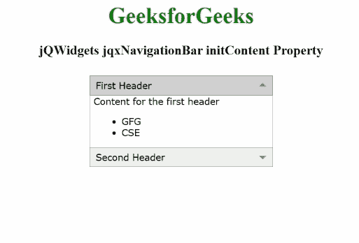

# jqxNavigationBar 的 initContent 属性

> 原文：[https://www.geeksforgeeks.org/jqwidgets-jqxnavigationbar-initcontent-property/](https://www.geeksforgeeks.org/jqwidgets-jqxnavigationbar-initcontent-property/)

**jQWidgets** 是一个 JavaScript 框架，用于为 PC 和移动设备制作基于 web 的应用程序。它是一个非常强大、优化、独立于平台并且得到广泛支持的框架。`jqxNavigationBar` 用于表示具有标题和内容部分的 jQuery 小部件。单击标题，内容将相应地展开或折叠。

`initContent` 属性用作回调函数，当项目的内容需要初始化时调用。这里的 `index` 参数显示了哪个项目被初始化了。

## 语法

设置 `initContent` 属性：

```javascript
$("Selector").jqxNavigationBar({
    initContent: function (index) {
        $("#jqxButton").jqxButton({ 
            $('#jqxbutton_for_initContent')
            .on('click', function () {
                $('#jqx_Navigation_Bar')
                    .jqxNavigationBar('disable');
            }); 
        });
    }
});
```

返回 `initContent` 属性：

```javascript
var initContent = 
    $('Selector').jqxNavigationBar('initContent');
```

## 链接文件

从给定链接下载 [jQWidgets](https://www.jqwidgets.com/download/)。在 HTML 文件中，找到下载文件夹中的脚本文件。

```html
<link rel="stylesheet" href="jqwidgets/styles/jqx.base.css" type="text/css">
<script type="text/javascript" src="scripts/jquery.js"></script>
<script type="text/javascript" src="jqwidgets/jqxcore.js"></script>
<script type="text/javascript" src="jqwidgets/jqxexpander.js"></script>
```

## 示例

以下示例说明了用于禁用导航栏的 jQWidgets `jqxNavigationBar` 的 `initContent` 属性。

### HTML

```html
<!DOCTYPE html>
<html lang="en">

<head>
    <link rel="stylesheet" 
          href="jqwidgets/styles/jqx.base.css"
          type="text/css"/>
    <script type="text/javascript" 
            src="scripts/jquery.js">
    </script>
    <script type="text/javascript" 
            src="jqwidgets/jqxcore.js">
    </script>
    <script type="text/javascript" 
            src="jqwidgets/jqxexpander.js">
    </script>
    <script type="text/javascript" 
            src="jqwidgets/jqxnavigationbar.js">
    </script>
</head>

<body>
    <center>
        <h1 style="color: green;">
            GeeksforGeeks
        </h1>
        <h3>
            jQWidgets jqxNavigationBar initContent Property
        </h3>
        <div id="jqx_Navigation_Bar" style="margin: 25px;" 
             align="left">
            <div>First Header</div>
            <div>
                <h8>Content for the first header</h8>
                <ul>
                    <li>GFG</li>
                    <li>CSE</li>
                </ul>
            </div>
            <div> Second Header</div>
            <div>
                <input type="button" style="margin: 29px;" 
                       id="jqxbutton_for_initContent"
                       value="Disable"/>
            </div>
        </div>
        <script type="text/javascript">
            $(document).ready(function () {
                $("#jqx_Navigation_Bar").
                    jqxNavigationBar({
                        width: 250,
                        height: 132,
                        initContent: function (index) {
                            if (index === 0) {
                                $('#jqxbutton_for_initContent').
                                    on('click', function () {
                                        $('#jqx_Navigation_Bar').
                                            jqxNavigationBar(
                                                'disable');
                                    });
                            }
                        }
                    });
                $("#jqxbutton_for_initContent").
                    jqxButton({
                        width: 100,
                    });
            });
        </script>
    </center>
</body>

</html>
```

## 输出



## 参考

[https://www.jqwidgets.com/jquery-widgets-documentation/documentation/jqxnavigationbar/jquery-navigationbar-api.htm?search=](https://www.jqwidgets.com/jquery-widgets-documentation/documentation/jqxnavigationbar/jquery-navigationbar-api.htm?search=)