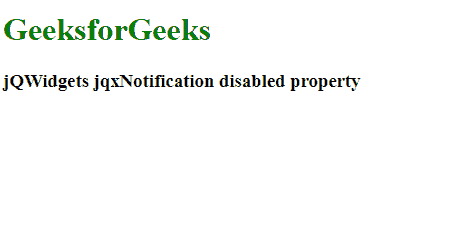

# jQWidgets jqxNotification 禁用属性

> 原文: [https://www.geeksforgeeks.org/jqwidgets-jqxnotification-disabled-property/](https://www.geeksforgeeks.org/jqwidgets-jqxnotification-disabled-property/)

`jQWidgets` 是一个 JavaScript 框架，用于为 PC 和移动设备制作基于 web 的应用程序。它是一个非常强大、优化、独立于平台并且得到广泛支持的框架。`jqxNotification` 代表一个 jQuery 小部件，可以用来向用户显示一些通知内容。`jqxNotification` 可以根据用户需求进行修改。

`disabled` 属性用于设置或返回 `disabled` 属性。即该属性用于设置或返回通知是否被禁用。接受布尔类型值，默认值为 `false`。

**语法:**

设置 `disabled` 属性。

```javascript
$('Selector').jqxNotification({ disabled : boolean });
```

返回 `disabled` 属性。

```javascript
var disabled = $('Selector').jqxNotification('disabled');
```

**链接文件:** 从链接下载 [jQWidgets](https://www.jqwidgets.com/download/Download)。在 HTML 文件中，找到下载文件夹中的脚本文件:

```html
<link rel="stylesheet" href="jqwidgets/styles/jqx.base.css" type="text/css">
<script type="text/javascript" src="scripts/jquery-1.11.1.min.js"></script>
<script type="text/javascript" src="jqwidgets/jqxcore.js"></script>
<script type="text/javascript" src="jqwidgets/jqxnotification.js"></script>
```

**示例:** 以下示例说明了 `jQWidgets` 中的 `jqxNotification` `disabled` 属性:

## 示例

```html
<!DOCTYPE html>
<html lang="en">

<head>
    <link rel="stylesheet" href=
    "jqwidgets/styles/jqx.base.css" type="text/css" />
    <script type="text/javascript" 
        src="scripts/jquery-1.11.1.min.js"></script>
    <script type="text/javascript" 
        src="jqwidgets/jqxcore.js"></script>
    <script type="text/javascript" 
        src="jqwidgets/jqxnotification.js"></script>
</head>

<body>
    <h1 style="color: green">
        GeeksforGeeks
    </h1>

<h3>jQWidgets jqxNotification disabled property</h3>

<div id="not">
        Notification
    </div>

<script type="text/javascript">
        $(document).ready(function () {
            $("#not").jqxNotification({
                width: "auto", 
                position: "top-left",
                opacity: 0.9,
                autoOpen: true,
                autoClose: false,
                disabled: true,
                template: "info",
                position: 'center'
            });
        });
    </script>
</body>

</html>
```

**输出:**



**参考:** [https://www.jqwidgets.com/jquery-widgets-documentation/documentation/jqxnotification/jquery-notification-api.htm?search=](https://www.jqwidgets.com/jquery-widgets-documentation/documentation/jqxnotification/jquery-notification-api.htm?search=)