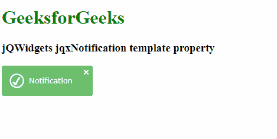

# jQWidgets jqxNotification 模板属性

> 原文：[https://www.geeksforgeeks.org/jqwidgets-jqxnotification-template-property/](https://www.geeksforgeeks.org/jqwidgets-jqxnotification-template-property/)

`jQWidgets` 是一个 JavaScript 框架，用于为 PC 和移动设备制作基于 web 的应用程序。它是一个非常强大和优化的框架，独立于平台，并得到广泛支持。`jqxNotification` 代表一个 jQuery 小部件，可以用来向用户显示一些通知内容。`jqxNotification` 小部件内容可以根据用户需求进行修改。

## 模板属性

`模板`属性用于设置或返回模板属性。即该属性用于设置或返回通知模板。它接受字符串类型值，默认值为“info”。

**其可能值如下。**

*   `"info"`：通知的颜色为蓝色。
*   `"warning"`：通知颜色为橙色。
*   `"success"`：通知的颜色为绿色。
*   `"error"`：通知的颜色为红色。
*   `"mail"`：通知的颜色为蓝色。
*   `"time"`：通知的颜色为黑色。
*   `"empty"`：通知的颜色为白色。

## 语法

*   设置`模板`属性。

```html
$('Selector').jqxNotification({ template : string });
```

*   返回`模板`属性。

```html
var template = $('Selector').jqxNotification('template');
```

## 链接文件

从链接下载 [https://www.jqwidgets.com/download/](https://www.jqwidgets.com/download/)。在 HTML 文件中，找到下载文件夹中的脚本文件：

```html
<link rel="stylesheet" href="jqwidgets/styles/jqx.base.css" type="text/css">
<script type="text/javascript" src="scripts/jquery-1.11.1.min.js"></script>
<script type="text/javascript" src="jqwidgets/jqxcore.js"></script>
<script type="text/javascript" src="jqwidgets/jqxnotification.js"></script>
```

## 示例

以下示例说明了 jQWidgets 中的 `jqxNotification` `模板`属性：

### HTML

```html
<!DOCTYPE html>
<html lang="en">

<head>
    <link rel="stylesheet" 
          href="jqwidgets/styles/jqx.base.css"
          type="text/css" />
    <script type="text/javascript" 
            src="scripts/jquery-1.11.1.min.js">
    </script>
    <script type="text/javascript" 
            src="jqwidgets/jqxcore.js">
    </script>
    <script type="text/javascript" 
            src="jqwidgets/jqxnotification.js">
    </script>
</head>

<body>
    <h1 style="color: green">
          GeeksforGeeks
      </h1>

<h3>jQWidgets jqxNotification template property</h3>

<div id="not">
        Notification
    </div>

<script type="text/javascript">
        $(document).ready(function () {
            $("#not").jqxNotification({
                position: "top-left",
                opacity: 0.9,
                autoOpen: true,
                autoClose: false,
                template: "success",
                position: 'center'
            });
        });
    </script>
</body>

</html>
```

## 输出



## 参考

[https://www.jqwidgets.com/jquery-widgets-documentation/documentation/jqxnotification/jquery-notification-api.htm?search=](https://www.jqwidgets.com/jquery-widgets-documentation/documentation/jqxnotification/jquery-notification-api.htm?search=)