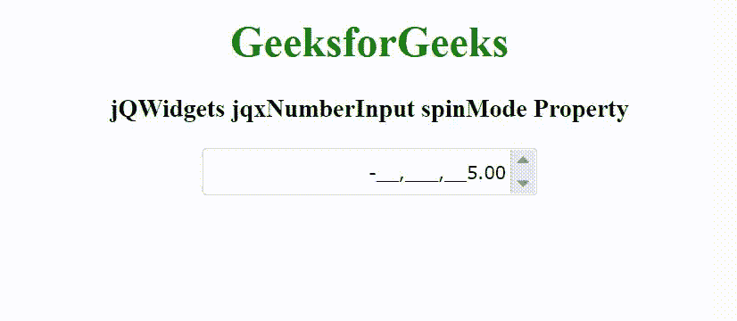

# jQWidgets jqxNumberInput spinMode 属性

> 原文: [https://www.geeksforgeeks.org/jqwidgets-jqxnumberinput-spinmode-property/](https://www.geeksforgeeks.org/jqwidgets-jqxnumberinput-spinmode-property/)

jQWidgets 是一个 JavaScript 框架，用于为 PC 和移动设备制作基于 web 的应用程序。它是一个非常强大、优化、独立于平台并且得到广泛支持的框架。`jqxNumberInput` 表示一个 jQuery 小部件，用于添加输入货币、百分比和任何类型的数字数据。输入数据可以以各种方式呈现。这个小部件的其他功能是自定义数字和小数位数、货币符号的字符串和位置、分组和小数分隔符。

`spinMode` 属性用于设置或返回自旋模式。它接受字符串类型值，默认值为 `"advanced"`。

它的可能值是：

*   `"advanced"` – 用于根据插入符号的位置增加/减少值。
*   `"simple"` – 用于禁用旋转行为。

## 语法

设置 `spinMode` 属性。

```javascript
$('selector').jqxNumberInput({ spinMode: String });
```

返回 `spinMode` 属性。

```javascript
var spinMode = $('selector').jqxNumberInput('spinMode');
```

## 链接文件

从给定的链接 [https://www.jqwidgets.com/download/](https://www.jqwidgets.com/download/) 下载 jQWidgets。在 HTML 文件中，找到下载文件夹中的脚本文件。

```html
<link rel="stylesheet" href="jqwidgets/styles/jqx.base.css" type="text/css" />
<script type="text/javascript" src="scripts/jquery-1.11.1.min.js"></script>
<script type="text/javascript" src="jqwidgets/jqxcore.js"></script>
<script type="text/javascript" src="jqwidgets/jqx-all.js"></script>
```

下面的例子说明了 jQWidgets jqxNumberInput `spinMode` 属性。

## 示例

### HTML

```html
<!DOCTYPE html>
<html lang="en">

<head>
    <link rel="stylesheet" href=
        "jqwidgets/styles/jqx.base.css" type="text/css" />
    <script type="text/javascript" 
        src="scripts/jquery-1.11.1.min.js"></script>
    <script type="text/javascript" 
        src="jqwidgets/jqxcore.js"></script>
    <script type="text/javascript" 
        src="jqwidgets/jqxnumberinput.js"></script>
    <script type="text/javascript" 
        src="jqwidgets/jqx-all.js"></script>
</head>

<body>
    <center>
        <h1 style="color: green;">
            GeeksforGeeks
        </h1>

        <h3>
            jQWidgets jqxNumberInput spinMode Property
        </h3>

        <div id='jqxNumberInput'></div>
    </center>

    <script type="text/javascript">
        $(document).ready(function() {
            $("#jqxNumberInput").jqxNumberInput({
                width: '250px',
                height: '35px',
                spinButtons: true,
                spinMode: 'simple'
            });
        });
    </script>
</body>

</html>
```

## 输出



## 参考

[https://www.jqwidgets.com/jquery-widgets-documentation/documentation/jqxnumberinput/jquery-number-input-api.htm](https://www.jqwidgets.com/jquery-widgets-documentation/documentation/jqxnumberinput/jquery-number-input-api.htm)