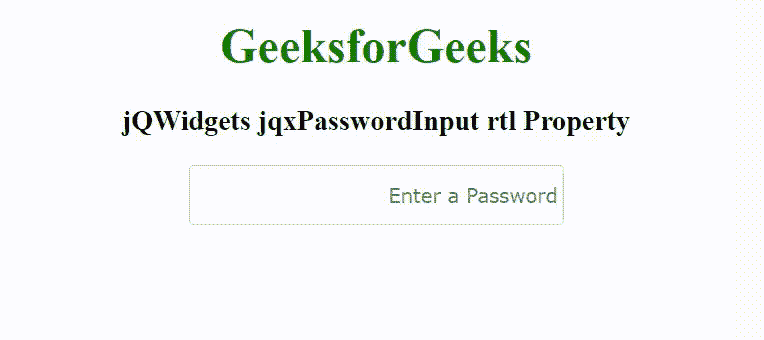

# jQWidgets jqxPasswordInput RTL 属性

> 原文：[`https://www.geeksforgeeks.org/jqwidgets-jqxpasswordinput-rtl-property/`](https://www.geeksforgeeks.org/jqwidgets-jqxpasswordinput-rtl-property/)

jQWidgets 是一个 JavaScript 框架，用于为 PC 和移动设备制作基于 web 的应用程序。它是一个非常强大、优化、独立于平台并且得到广泛支持的框架。`jqxPasswordInput` 是一个 jQuery 小部件，它支持输入字段密码，并对密码的强度有很好的视觉反馈。

`rtl` 属性用于设置或返回是否启用从右向左支持。它接受布尔类型值，默认值为 `false`。

### 语法

设置 `rtl` 属性。
```javascript
$('selector').jqxPasswordInput({ rtl: Boolean });
```
获取 `rtl` 属性的值。
```javascript
var rtl = $('selector').jqxPasswordInput('rtl');
```

### 链接文件
从链接 [`https://www.jqwidgets.com/download/`](https://www.jqwidgets.com/download/) 下载 jQWidgets。在 HTML 文件中，找到下载文件夹中的脚本文件。
```html
<link rel="stylesheet" href="jqwidgets/styles/jqx.base.css" type="text/css" />
<script type="text/javascript" src="scripts/jquery-1.11.1.min.js"></script>
<script type="text/javascript" src="jqwidgets/jqxcore.js"></script>
<script type="text/javascript" src="jqwidgets/jqx-all.js"></script>
```

下面的例子说明了 jQWidgets 中的 `jqxPasswordInput` `rtl` 属性。

### 示例

## HTML
```html
<!DOCTYPE html>
<html lang="en">

<head>
    <link rel="stylesheet" href=
        "jqwidgets/styles/jqx.base.css" type="text/css" />
    <script type="text/javascript" 
        src="scripts/jquery-1.11.1.min.js"></script>
    <script type="text/javascript" 
        src="jqwidgets/jqxcore.js"></script>
    <script type="text/javascript" 
        src="jqwidgets/jqx-all.js"></script>
    <script type="text/javascript" 
        src="jqwidgets/jqxpasswordinput.js"></script>
</head>

<body>
    <center>
        <h1 style="color: green;">
            GeeksforGeeks
        </h1>
        <h3>
            jQWidgets jqxPasswordInput rtl Property
        </h3>
        <input type="password" id="input" />
    </center>

    <script type="text/javascript">
        $(document).ready(function() {
            $("#input").jqxPasswordInput({
                width: 250,
                height: 40,
                placeHolder: "Enter a Password",
                rtl: true
            });
        });
    </script>
</body>

</html>
```

### 输出


### 参考
[`https://www.jqwidgets.com/jquery-widgets-documentation/documentation/jqxpasswordinput/jquery-password-input-getting-started.htm`](https://www.jqwidgets.com/jquery-widgets-documentation/documentation/jqxpasswordinput/jquery-password-input-getting-started.htm)