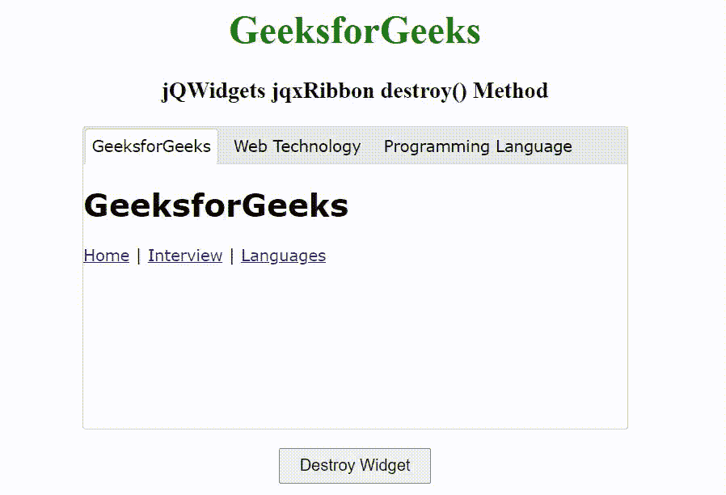

# jQWidgets jqxRibbon `destroy()`方法

> 原文：[https://www.geeksforgeeks.org/jqwidgets-jqxribbon-destroy-method/](https://www.geeksforgeeks.org/jqwidgets-jqxribbon-destroy-method/)

`jQWidgets`是一个JavaScript框架，用于为PC和移动设备制作基于web的应用程序。它是一个非常强大和优化的框架，独立于平台，并得到广泛支持。`jqxRibbon`是一个jQuery小部件，可以用作选项卡式工具栏或大型菜单。

`destroy()`方法用于销毁`jqxRibbon`小部件。它不接受任何参数，也不返回值。

## 语法

```javascript
$('#jqxRibbon').jqxRibbon('destroy');
```

## 链接文件

从给定链接下载[jQWidgets](https://www.jqwidgets.com/download/)。在HTML文件中，找到下载文件夹中的脚本文件。

```html
<link rel="stylesheet" href="jqwidgets/styles/jqx.base.css" type="text/css">
<script type="text/javascript" src="scripts/jquery-1.11.1.min.js"></script>
<script type="text/javascript" src="jqwidgets/jqxcore.js"></script>
<script type="text/javascript" src="jqwidgets/jqx-all.js"></script>
```

## 示例

下面的示例说明了`jQWidgets` `jqxRibbon` `destroy()`方法。

### HTML

```html
<!DOCTYPE html>
<html lang="en">

<head>
    <link rel="stylesheet" href=
        "jqwidgets/styles/jqx.base.css" type="text/css" />
    <link rel="stylesheet" href=
        "jqwidgets/styles/jqx.energyblue.css" type="text/css" />
    <script type="text/javascript" 
        src="scripts/jquery-1.11.1.min.js"></script>
    <script type="text/javascript" 
        src="jqwidgets/jqx-all.js"></script>
    <script type="text/javascript" 
        src="jqwidgets/jqxcore.js"></script>
    <script type="text/javascript" 
        src="jqwidgets/jqxribbon.js"></script>
</head>

<body>
    <center>
        <h1 style="color: green;">
            GeeksforGeeks
        </h1>
        <h3>
            jQWidgets jqxRibbon destroy() Method
        </h3>
    </center>

    <div id="jqxRibbon" style="margin: auto;">
        <ul>
            <li>GeeksforGeeks</li>
            <li>Web Technology</li>
            <li>Programming Language</li>
        </ul>
        <div>
            <div>
                <h1>GeeksforGeeks</h1>
                <nav>
                    <a href="#">Home</a> |
                    <a href="#">Interview</a> |
                    <a href="#">Languages</a>
                </nav>
            </div>
            <div>
                <h1>Web Technology</h1>
                <nav>
                    <a href="#">HTML</a> |
                    <a href="#">CSS</a> |
                    <a href="#">JavaScript</a>
                </nav>
            </div>
            <div>
                <h1>Programming Language</h1>
                <nav>
                    <a href="#">C Programming</a> |
                    <a href="#">C++ Programming</a> |
                    <a href="#">Java Programming</a>
                </nav>
            </div>
        </div>
    </div>

    <center>
        <input type="button" id="jqxBtn" 
            value="Destroy Widget" 
            style="padding: 5px 15px; margin-top: 15px;">
    </center>

    <script type="text/javascript">
        $(document).ready(function() {
            $("#jqxRibbon").jqxRibbon({
                width: 450,
                height: 250,
                reorder: true
            });

            $("#jqxBtn").on("click", function() {
                $("#jqxRibbon").jqxRibbon("destroy");
            });
        });
    </script>
</body>

</html>
```

## 输出



## 参考

[https://www.jqwidgets.com/jquery-widgets-documentation/documentation/jqxribbon/jquery-ribbon-api.htm](https://www.jqwidgets.com/jquery-widgets-documentation/documentation/jqxribbon/jquery-ribbon-api.htm)