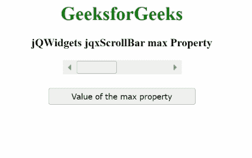

# jQWidgets jqxScrollBar max 属性

> 原文: [https://www.geeksforgeeks.org/jqwidgets-jqxscrollbar-max-property/](https://www.geeksforgeeks.org/jqwidgets-jqxscrollbar-max-property/)

**jQWidgets** 是一个 JavaScript 框架，用于为 PC 和移动设备制作基于 web 的应用程序。它是一个非常强大、优化、独立于平台并且得到广泛支持的框架。`jqxScrollBar` 用于表示 jQuery 小部件，该部件提供了一个滚动条，该滚动条具有滑动的拇指，其位置对应于一个值。

`max` 属性用于设置或获取指定 `jqxScrollBar` 的最大值。

**语法:**

*   用于设置 `max` 属性。

```javascript
$('#jqxScrollBar').jqxScrollBar({ max: 200 });
```

*   获取 `max` 属性。

```javascript
var max = $('#jqxScrollBar').jqxScrollBar('max');
```

**链接文件:** 从给定链接下载 [jQWidgets](https://www.jqwidgets.com/download/) 。在 HTML 文件中，找到下载文件夹中的脚本文件。

```html
<link rel="stylesheet" href="jqwidgets/styles/jqx.base.css" type="text/css"/>
<script type="text/javascript" src="scripts/jquery.js"></script>
<script type="text/javascript" src="jqwidgets/jqxcore.js"></script>
<script type="text/javascript" src="jqwidgets/jqxbuttons.js"></script>
```

**示例:** 以下示例说明了 jQWidgets `jqxScrollBar` 的 `max` 属性。在下面的示例中， `max` 属性的值被设置为 200。

## HTML

```html
<!DOCTYPE html>
<html lang="en">

<head>
    <link rel="stylesheet" 
          href="jqwidgets/styles/jqx.base.css"
          type="text/css"/>
    <script type="text/javascript" 
            src="scripts/jquery.js">
    </script>
    <script type="text/javascript" 
            src="jqwidgets/jqxcore.js">
    </script>
    <script type="text/javascript" 
            src="jqwidgets/jqxbuttons.js">
    </script>
    <script type="text/javascript" 
            src="jqwidgets/jqxscrollbar.js">
    </script>
    <script type="text/javascript" 
            src="jqwidgets/jqx-all.js">
    </script>
</head>

<body>
    <center>
        <h1 style="color:green;">
            GeeksforGeeks
        </h1>
        <h3>
            jQWidgets jqxScrollBar max Property
        </h3>
        <div id='jqx_Scroll_Bar'></div>
        <input type="button" style="margin:28px;" 
               id="button_for_max" 
              value="Value of the max property"/>
        <div id="log"></div>
        <script type="text/javascript">
            $(document).ready(function () {
                $("#jqx_Scroll_Bar").jqxScrollBar({
                    width: 200,
                    height: 20,
                    max: 200
                });
                $("#button_for_max").jqxButton({
                    width: 250
                });
                $("#button_for_max").jqxButton()
                .click(function () {
                    var Value_of_max =
                        $('#jqx_Scroll_Bar').jqxScrollBar('max');
                    $("#log").html((Value_of_max));
                 });
            });
        </script>
    </center>
</body>
</html>
```

**输出:**



**参考:** [https://www.jqwidgets.com/jquery-widgets-documentation/documentation/jqxscrollbar/jquery-scrollbar-api.htm?search=](https://www.jqwidgets.com/jquery-widgets-documentation/documentation/jqxscrollbar/jquery-scrollbar-api.htm?search=)